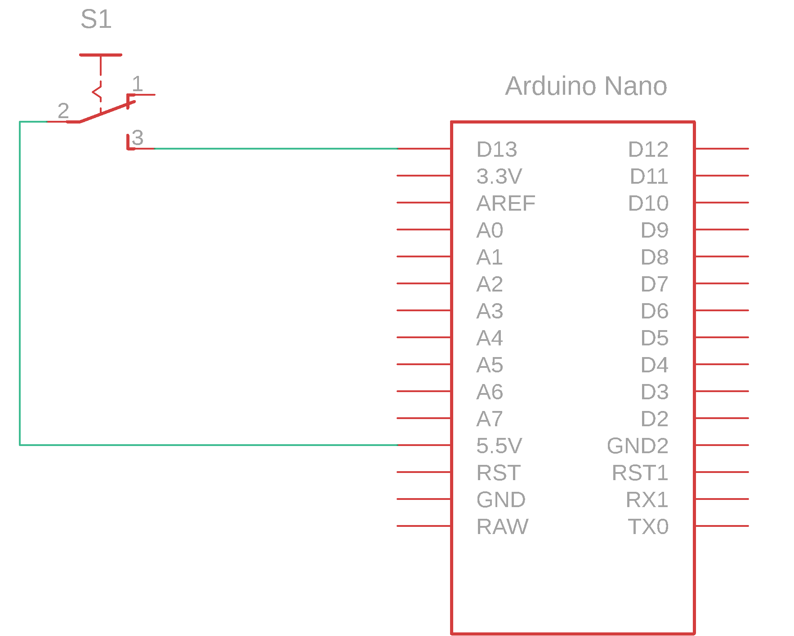
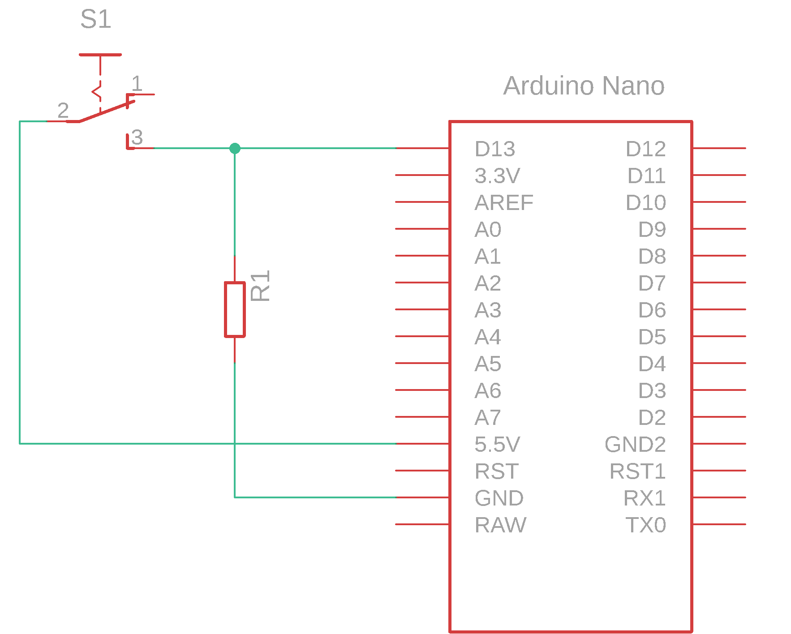

# Tipka in mikrokrmilnik

Če želimo prenesti informacijo o stanju tipke v mikrokrmilnik moramo zgraditi električno vezje. Gradnjo električnega vezja pričnemo z izdelavo električne sheme.

## Električna shema

Električna shema povezuje stikalo in mikrokrmilnik kot je prikazano na sliki.

<figure><figcaption>
Priključitev tipke na mikrokrmilnik
</figcaption></figure>

Tipka z oznako **S1** je povezana na eni strani na pin **5V** in na drugi strani na pin **D13** razvojne ploščice. Pin **5V** ima vedno napetostni potencial _5V_ čim je vklopljeno napajanje razvojne ploščice. Napajanje razvojne ploščice je izvedeno preko USB vmesnika, ki povezuje računalnik z razvojno ploščico in se uporablja tudi za nalaganje programa.

Delovanje vezja:

* Ko tipko aktiviramo steče tok iz pina **5V** v pin **D13**. Ker imajo vhodi mikrokrmilnika visoko omsko upornost (100 _M_Ω) je tok, ki steče majhen (reda nekaj 10 _nA_). Upornost žice je nizka zato je padec napetosti majhen in se ves napetostni potencial prenese na vhod mikrokrmilnika v našem primeru je to _5V_.
* Ko tipko deaktiviramo prekinemo tokokrog in na vhod mikrokrmilnika ne dobimo napetostnega potenciala s strani stikala.


**POZOR** V električnih vezjih je potrebno vedno paziti na ožičenja, ki so na eni strani priključena na vhode mikrokrmilnika na drugi strani pa prosta. Namreč vsak tak vodnik predstavlja anteno, ki lovi magnetno polje in inducira električne napetosti. Ker so vhodi mikrokrmilnika visoko omski inducirane napetosti poženejo dovolj velike tokove, da jih vhod mikrokrmilnika zazna kot logično visok potencial.


Za pravilno delovanje moramo dodati (pull-down) upor v naše vezje. Obsežnejšo razlago o tej tematiki lahko najdete v priročniku. Popravljeno električno shemo prikazuje spodnja slika.

<figure><figcaption></figcaption></figure>

Ko je tipka neaktivna sedaj vodnik ni več prost ampak je preko upora **R1** povezan na nizek napetostni potencial. Vsak tok, ki je posledica inducirane napetosti sedaj odteče preko upora na nizek potencial, ker je upornost **R1** za dekado nižja od upornosti vhoda mikrokrmilnika.

### Električne komponente

| Komponenta      | Koda         | Proizvajalec    | Podatkovni list |
| --------------- | ------------ | --------------- | --------------- |
| tipka           | KS11R22CQD   | C\&K COMPONENTS | datoteka        |
| mikrokrmilnik   | ATmega328    | Microchip       | datoteka        |
| razvojna plošča | Arduino Nano | Gravitech       | datoteka        |
| upor            | /            | Multicomp       | datoteka        |

### Dimenzioniranje komponent

**Upor R1**

Vrednost upora mora biti dovolj velika, da ob aktivnem stikalu ne trošimo preveč energije in dovolj majhen, da preusmeri večino induciranega toka preko sebe na nizek napetostni potencial. Velikost upora se lahko izračuna vendar večinoma uporabimo izkustvene vrednosti. Velikost upora določimo glede na potrebe:

* $3,3k\Omega...10k\Omega$ za splošno uporabo
* $50k\Omega...100k\Omega$ se uporablja tam kjer je pomembna poraba energije
* $200\Omega...1k\Omega$ se uporablja tam kjer je pomembna hitrost preklapljanja
