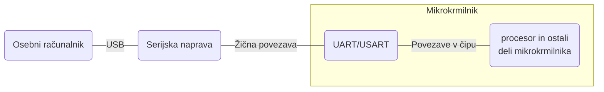
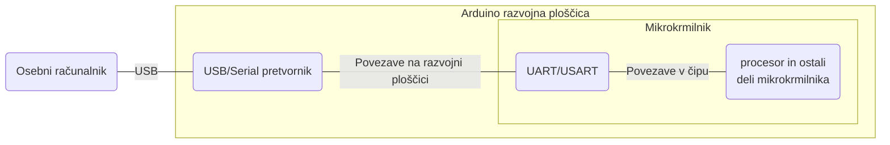

# Uporaba serijske komunikacije

Serijska povezava omogoča znakovno dvosmerno komunikacijo z vzpostavitvijo komunikacijskega kanala med mikrokrmilnikom in osebnim računalnikom kot prikazuje slika


### Elektrotehnični del

Serijska povezava povezuje dve serijski napravi, kar pomeni, da mora tako osebni računalnik kot mikrokrmilnik to omogočati. Računalniki, po večini, nimajo vgrajene serijske naprave tako, da je potrebno serijsko napravo dodati (primer). Tako serijsko naprave se poveže na računalnik preko kakega drugega vodila najpogosteje je to USB. Skoraj vsi mikrokrmilniki imajo serijsko napravo vgrajeno v čip kot eno izmed perifernih naprav. Najdemo jo pod imenom UART ali USART. Shema serijske povezave bolj natančno izgleda kot je prikazano na sliki



Serijsko komunikacijo določa standard RS232, katerega osnove so povzete v gradivu.

#### Serijska povezava z Arduinom

Uporaba serijskege povezave pri Arduino razvojnih ploščicah je poenostavljena saj ima Arduino že vgrajen USB/Serial pretvornik za povezavo z osebnim računalnikom. Torej shema serijske povezave izgleda tako



### Programski del

Uporaba serijske naprave na računalniku je mogoča z posebno programsko opremo, ki za uporabnika ustvari konzolo preko katere nato prejemamo in zapisujemo sporočila. Arduino IDE ima konzolno aplikacijo že vgrajeno. Za uporabo serijske naprave na strani mikrokrmilnika pa je potrebno napisati program, oz če uporabljamo Arduino razvojno okolje imamo na voljo knjižnico [Serial](https://www.arduino.cc/reference/en/language/functions/communication/serial/), ki poskrbi za pravilno konfiguracijo vgrajene serijske naprave in omogoča njeno uporabo na uporabniku prijazen način.

#### Zapisovanje nizov

Program bo vzpostavil serijsko komunikacijo z osebnim računalnikom in izpisoval stanje števca, katerega vrednost se povečuje na 1s.

```c
//Globalne spremenljivke
//Spremenljivka števca
int stevec = 0;

//Nastavitvena funkcija
void setup() {
  //Vzpostavimo serijsko komunikacijo in nastavimo njeno hitrost
  Serial.begin(9600);
}

//Krožna funkcija
void loop() {
  //Zapišemo spremni niz na serijsko povezavo
  Serial.print("Števec: ");
  //Zapišemo stanje števca na serijsko povezavo
  Serial.println(stevec);
  //Zakasnitev za 1s
  delay(1000);
}
```

Pri prvem zapisu smo uporabili ukaz _Serial.print()_, ki nam na serijsko povezavo zapiše želeni niz. Pri drugem pa smo uporabili ukaz _Serial.println()_, ki nam poleg želenega niza na koncu doda znak za novo vrstico, kar se odraža v vrstičnem izpisu na konzoli. Enak učinek bi dosegli če bi zapisali niz $\n$ kot argument funkcije _Serial.print()_.

#### Branje znakov

Program bo prebral poslane znake in ob znaku "1" vklopil vgrajeno LED ob znaku "0" pa jo izklopil.

```c
//Nastavitvena funkcija
void setup() {
  //Vzpostavimo serijsko komunikacijo in nastavimo njeno hitrost
  Serial.begin(9600);
}
//Krožna funkcija
void loop() {
  //Preverimo ali se je v serijskem zalogovniku znakov pojavil kakšen znak
  if (Serial.available() > 0) {
    //Prebiramo vrednosti poslane po serijski povezavi
    int znak = Serial.read();
    //Ali je poslani znak enak številki 49 po ASCI kodiranju oz. znaku '1'
    if (znak == '1') {
      digitalWrite(LED_BUILTIN, HIGH);
    }
    //Ali je poslani znak enak številki 48 po ASCI kodiranju oz. znaku '0'
    if (znak == 48) {
      digitalWrite(LED_BUILTIN, LOW);
    }
  }
}
```

Uporaba funkcije _Serial.available()_ pohitri delovanje programa saj hitro preveri ali je prispel kak znak. Če bi uporabljali samo funkcijo _Serial.read()_ bi program vsak cikel izvedel branje, kar bi izredno upočasnilo izvajanje programa.

#### Branje in pisanje nizov

Program bo prebral poslan niz in ob vrednosti "vklopi" vklopil vgrajeno LED in izpisal "led prizgana". Če bo vrednost niza "izklopi" pa bo LED izklopil in izpisal "led ugasnjena".

```c
//Nastavitvena funkcija
void setup() {
  //Vzpostavimo serijsko komunikacijo in nastavimo njeno hitrost
  Serial.begin(9600);
}
//Krožna funkcija
void loop() {
  //Preverimo ali se je v serijskem zalogovniku znakov pojavil kakšen znak
  if (Serial.available() > 0) {
    //Prebiramo vrednosti nizev poslanih po serijski povezavi
    String niz = Serial.readString();
    //Odstranimo zadnji znak niza \n, ki nakazuje konec niza
    niz = niz.substring(0, niz.length() - 1);

    //Ali je poslani niz enak 'vklopi'
    if ( niz == "vklopi") {
      digitalWrite(LED_BUILTIN, HIGH);
      Serial.println("led prizgana");
    }
    //Ali je poslani niz enak 'izklopi'
    if (niz == "izklopi") {
      digitalWrite(LED_BUILTIN, LOW);
      Serial.println("led ugasnjena");
    }
  }
}
```


**Pozor!** Uporaba serijske komunikacije je časovno potraten proces in zavira delovanje mikrokrmilnika.

