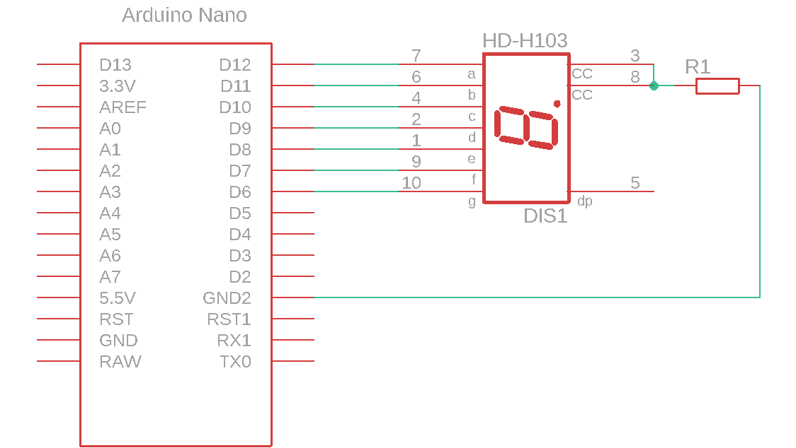
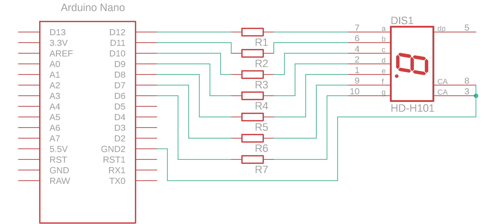

# 7-segmentni LED prikazovalnik in mikrokrmilnik

7-segmentni prikazovalnik se uporablja za prikazovanje števk desetiškega sistema.

### Električna shema

Prikazovalnik zvežemo kot prikazuje shema.

<figure><figcaption>
Priključitev prikazovalnika z enim uporom R1
</figcaption></figure>


**POZOR** Priklop prikazovalnika kot ga prikazuje spodnja shema ni optimalen saj se s spreminjanjem števila prižganih LED spreminja tok skozi upor $$R_{1}$$. Spremenjen tok spremeni padec napetosti na uporu in napetosti na LED, kar privede do spremenjene svetlosti. Torej več kot imamo prižganih LED manj svetijo, kar pa ni zaželen pojav.


<figure><figcaption>
Priključitev 7 segmentnega prikazovalnika z enim uporom na segment
</figcaption></figure>

### Električne komponente

| Komponenta      | Koda         | Proizvajalec | Podatkovni list                                                                                                                                                                                                                 |
| --------------- | ------------ | ------------ | ------------------------------------------------------------------------------------------------------------------------------------------------------------------------------------------------------------------------------- |
| prikazovalnik   | SC52-11HWA   | Kingbright   | [datoteka](https://files.gitbook.com/v0/b/gitbook-x-prod.appspot.com/o/spaces%2FOjZ1XG64rvc2AeRBUH5H%2Fuploads%2FiTDJNQEXWQcxz4gnSSSU%2FKingbright-SC52-11HWA.pdf?alt=media\&token=5a0e4220-5252-404e-8171-041c73c52f6c)        |
| mikrokrmilnik   | ATmega328    | Microchip    | [datoteka](https://files.gitbook.com/v0/b/gitbook-x-prod.appspot.com/o/spaces%2FOjZ1XG64rvc2AeRBUH5H%2Fuploads%2FVdyx5L6r6wqAilPGHpen%2FATmega.pdf?alt=media\&token=a7f48452-034e-4411-b859-d87bf77d7454)                       |
| razvojna plošča | Arduino Nano | Gravitech    | [datoteka](https://files.gitbook.com/v0/b/gitbook-x-prod.appspot.com/o/spaces%2FOjZ1XG64rvc2AeRBUH5H%2Fuploads%2FmBK4u5xIBnLKRFzfea5q%2FGravitech\_Arduino\_Nano3\_0.pdf?alt=media\&token=b8cb7c7d-aee0-4845-863b-88c382cca882) |
| upori           | /            | Multicomp    | [datoteka](https://files.gitbook.com/v0/b/gitbook-x-prod.appspot.com/o/spaces%2FOjZ1XG64rvc2AeRBUH5H%2Fuploads%2FwniMD8SuO6uL0i9SD8N2%2Fupor.pdf?alt=media\&token=3553e1a0-af07-4fd2-8af3-615a8cee41e7)                         |

### Dimenzioniranje komponent

Pri izračunu zaščitnih uporov LED 7 segmentnega prikazovalnika si pomagajte z [gradivom](led-in-mikrokrmilnik.md).
