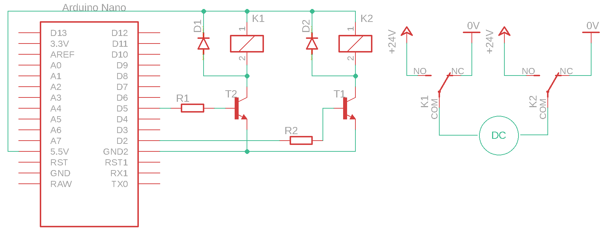

# Enosmerni motor in mikrokrmilnik

Enosmerni motor je eden najpogostejših aktuatorjev. Uporablja za različne namene kot so poganjanje mešal, tekočih trakov, ventilov, črpalk, ... Na sliki je primer enosmernega električnega motorja

<figure><figcaption>
Enosmerni električni motor
</figcaption></figure>

Enosmerni elektromotor ima dva električna priključka, na katera priključimo napetostni vir in poženemo motor. Smer vrtenja motorja je odvisna od smeri električnega toka.

Motor lahko krmilimo na več različnih načinov. V nadaljevanju predstavljamo 3 načine za vse pa uporabljamo enake električne komponente, ki se jih tudi na enak način dimenzionira.

## Električne komponente

| Komponenta      | Koda         | Proizvajalec     | Podatkovni list                                                                                                                                                                                                                 |
| --------------- | ------------ | ---------------- | ------------------------------------------------------------------------------------------------------------------------------------------------------------------------------------------------------------------------------- |
| elektromotor    | 37488        | FischerTechnik   | [datoteka](https://files.gitbook.com/v0/b/gitbook-x-prod.appspot.com/o/spaces%2FOjZ1XG64rvc2AeRBUH5H%2Fuploads%2FGLSsD9tC9dNNH42jTjeJ%2Fftspares.pdf?alt=media\&token=2e875bd6-322a-431e-bf60-9f0cf77b16e4)                     |
| rele            | V23105       | AXICOM           | [datoteka](https://files.gitbook.com/v0/b/gitbook-x-prod.appspot.com/o/spaces%2FOjZ1XG64rvc2AeRBUH5H%2Fuploads%2FNozBDqjgGq8wwq5ogwFr%2FreleyV23105.pdf?alt=media\&token=6e9614c8-4e16-4238-b2bd-0e36a72d839d)                  |
| tranzistor      | BC550        | ON Semiconductor | [datoteka](https://files.gitbook.com/v0/b/gitbook-x-prod.appspot.com/o/spaces%2FOjZ1XG64rvc2AeRBUH5H%2Fuploads%2FNkIToA5TJdzhLiJa8uWY%2FtranBC550.pdf?alt=media\&token=64e3614f-356d-40e2-867e-8471feb14908)                    |
| dioda           | 1N4007       | FairChild        | [datoteka](https://files.gitbook.com/v0/b/gitbook-x-prod.appspot.com/o/spaces%2FOjZ1XG64rvc2AeRBUH5H%2Fuploads%2FVo1DGisQWbUp2fduCfXv%2F1N4007-471020.pdf?alt=media\&token=9852369f-aa20-4b5d-80e7-1aeb8fe76d6a)                |
| mikrokrmilnik   | ATmega328    | Microchip        | [datoteka](https://files.gitbook.com/v0/b/gitbook-x-prod.appspot.com/o/spaces%2FOjZ1XG64rvc2AeRBUH5H%2Fuploads%2FVdyx5L6r6wqAilPGHpen%2FATmega.pdf?alt=media\&token=a7f48452-034e-4411-b859-d87bf77d7454)                       |
| razvojna plošča | Arduino Nano | Gravitech        | [datoteka](https://files.gitbook.com/v0/b/gitbook-x-prod.appspot.com/o/spaces%2FOjZ1XG64rvc2AeRBUH5H%2Fuploads%2FmBK4u5xIBnLKRFzfea5q%2FGravitech\_Arduino\_Nano3\_0.pdf?alt=media\&token=b8cb7c7d-aee0-4845-863b-88c382cca882) |
| upor            | /            | Multicomp        | [datoteka](https://files.gitbook.com/v0/b/gitbook-x-prod.appspot.com/o/spaces%2FOjZ1XG64rvc2AeRBUH5H%2Fuploads%2FwniMD8SuO6uL0i9SD8N2%2Fupor.pdf?alt=media\&token=3553e1a0-af07-4fd2-8af3-615a8cee41e7)                         |

## Dimenzioniranje komponent

Postopek dimenzioniranje releja, tranzistorja in uporov si lahko pogledate v [gradivu](rele-in-mikrokrmilnik.md)

Pri izbiri releja moramo zagotoviti, da je specificiran maksimalni trajni tok skozi kontakt releja večji od toka enosmernega motorja. V našem primeru je obratovalni tok motorja $$1A$$ dovoljeni trajni tok kontakta releja pa $$3A$$, kar pomeni, da rele lahko uporabimo za krmiljenje motorja.

## Krmiljenje motorja v režimu vklop/izklop

Krmiljenje motorja v režimu vklop/izklop pomeni, da motor upravljamo kot digitalno breme in ima torej dve stanji motor stoji in motor se vrti. Električna shema povezuje motor s mikrokrmilnikom preko releja, kot prikazuje slika.

<figure><figcaption>
Shema električnega vezja za krmiljenje motorja VKLOP/IZKLOP
</figcaption></figure>

Opis in delovanje vezja si lahko pogledate v [gradivu](rele-in-mikrokrmilnik.md). Kontakt releja smo zaporedno vezali z enosmernim motorjem. Aktivacija releja sklene kontakt **K1** in skozi motor steče električni tok, ki požene motor v gibanje.

## Krmiljenje motorja v obe smeri

Električna shema povezuje motor s mikrokrmilnikom preko releja, kot prikazuje slika.

<figure><figcaption>
Shema električnega vezja za krmiljenje elektromotorja v obe smeri
</figcaption></figure>

Kadar imamo na voljo releje, ki imajo kontakt izveden, tako da sta dostopna oba stanja (odprt in zaprt) lahko uporabimo samo dva digitalna izhoda mikrokrmilnika za krmiljenje motorja. Stanje motorja popisuje tabela

| K1 | K2 | Motor  |
| -- | -- | ------ |
| 0  | 0  | miruje |
| 0  | 1  | levo   |
| 1  | 0  | desno  |
| 1  | 1  | miruje |

## Krmiljenje motorja v obe smeri s H mostičem

Električna shema povezuje motor s mikrokrmilnikom preko releja, kot prikazuje slika.

<figure><figcaption>
Električna shema vezja za krmiljenje elektro motorja z H mostičem
</figcaption></figure>

Kadar imamo na voljo releje, ki imajo kontakt izveden, tako da je dostopen sam eno stanje (zaprt) moramo uporabit 4 digitalne izhode mikrokrmilnika za krmiljenje motorja. Pri tej izvedbi moramo paziti, da pravilno krmilimo digitalne izhode saj lahko ob hkratni aktivaciji dveh zaporedno vezanih relejev pride do kratkega stika. Stanje motorja popisuje tabela

| K1 | K2 | K3 | K4 | Motor  |
| -- | -- | -- | -- | ------ |
| 0  | 0  | 0  | 0  | miruje |
| 0  | 1  | 1  | 0  | desno  |
| 1  | 0  | 0  | 1  | levo   |

Vse ostale možnosti vključevanja relejev ali privedejo do kratkega stika ali pa bo motor miroval.
