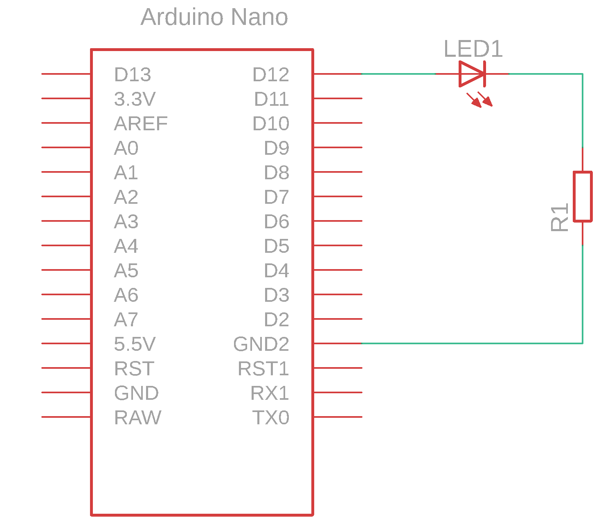
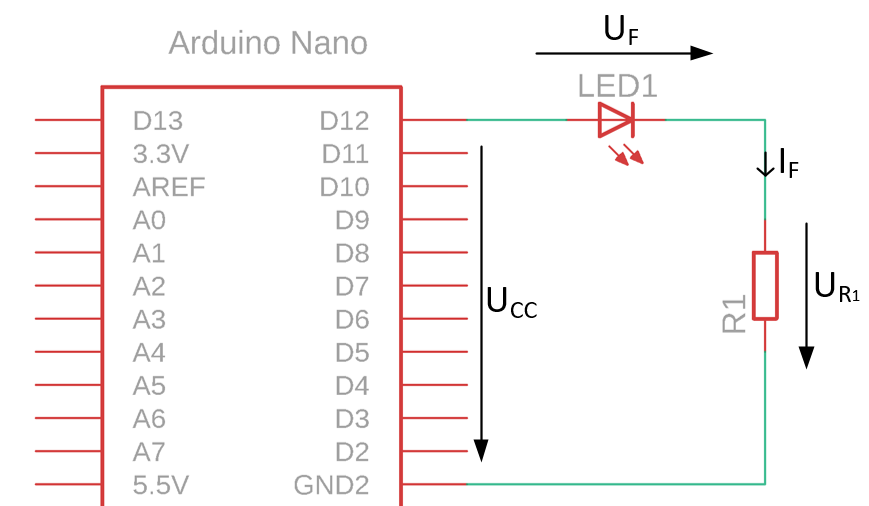
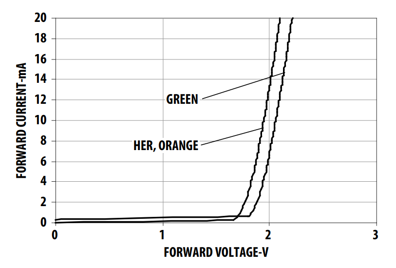

# LED in mikrokrmilnik

Če želimo prenesti informacijo iz mikrokrmilnika na LED moramo zgraditi električno vezje. Gradnjo električnega vezja pričnemo z izdelavo električne sheme.

## Električna shema

Električna shema povezuje LED in mikrokrmilnik kot je prikazano na sliki.

<figure><figcaption></figcaption></figure>

LED dioda z oznako **LED1** je povezana na eni strani na pin **D12** in na drugi strani na upor **R1**. Upor **R1** je na drugi strani povezan na nizek potencial mikrokrmilnika.

Delovanje vezja:

* Ko program na izhod mikrokrmilnika zapiše informacijo logično visoke vrednosti se na pinu **D12** pojavi napetost $5V$. Skozi LED diodo in upor steče tok in LED dioda zasveti.


**POZOR** V električnih vezjih je potrebno poskrbeti za zaščito elementov. LED dioda za pravilno delovanje potrebuje zaščito upora.


Za pravilno delovanje LED diode moramo dodati upor v naše vezje ter ga pravilno dimenzionirati glede na lastnosti LED diode.

## Električne komponente

| Komponenta      | Koda         | Proizvajalec | Podatkovni list                                                                                                                                                                                                                 |
| --------------- | ------------ | ------------ | ------------------------------------------------------------------------------------------------------------------------------------------------------------------------------------------------------------------------------- |
| LED             | HLMP-Y301    | AVAGO        | [datoteka](https://files.gitbook.com/v0/b/gitbook-x-prod.appspot.com/o/spaces%2FOjZ1XG64rvc2AeRBUH5H%2Fuploads%2FPyS4PalUJ0fYJHMjE9ch%2Fled.pdf?alt=media\&token=b35575d1-fe44-409f-8115-6a4a8f0ca843)                          |
| mikrokrmilnik   | ATmega328    | Microchip    | [datoteka](https://files.gitbook.com/v0/b/gitbook-x-prod.appspot.com/o/spaces%2FOjZ1XG64rvc2AeRBUH5H%2Fuploads%2FVdyx5L6r6wqAilPGHpen%2FATmega.pdf?alt=media\&token=a7f48452-034e-4411-b859-d87bf77d7454)                       |
| razvojna plošča | Arduino Nano | Gravitech    | [datoteka](https://files.gitbook.com/v0/b/gitbook-x-prod.appspot.com/o/spaces%2FOjZ1XG64rvc2AeRBUH5H%2Fuploads%2FmBK4u5xIBnLKRFzfea5q%2FGravitech\_Arduino\_Nano3\_0.pdf?alt=media\&token=b8cb7c7d-aee0-4845-863b-88c382cca882) |
| upor            | /            | Multicomp    | [datoteka](https://files.gitbook.com/v0/b/gitbook-x-prod.appspot.com/o/spaces%2FOjZ1XG64rvc2AeRBUH5H%2Fuploads%2FwniMD8SuO6uL0i9SD8N2%2Fupor.pdf?alt=media\&token=3553e1a0-af07-4fd2-8af3-615a8cee41e7)                         |

## Dimenzioniranje komponent

Pri dimenzioniranju komponent si pomagamo s shemo na sliki, ki prikazuje električne veličine vezja.

<figure><figcaption>
Oznake električnih veličin
</figcaption></figure>

### Upor R1

Iz podatkovnega lista LED diode razberemo podatek o maksimalnemu toku diode (DC Forward Current), ki znaša _20mA_. Odločimo se, da LED dioda dovolj sveti tudi pri polovičnem toku _10mA_, zato bomo dimenzionirali vezje na ta tok. Padec napetosti na diodi pri toku _10mA_ je približno _2V_, kar razberemo iz karakteristike:

<figure><figcaption>
Napetostno tokovna karakteristika LED diode
</figcaption></figure>

Vrednost upora R1 izračunamo po enačbi:

$$
R_1 = \frac{U_{R_1}}{I_F}=\frac{U_{CC}-U_F}{I_F}
$$

Vstavimo poznane veličine:

* $$U_{CC}=5V$$ napajalna napetost mikrokontrolerja
* $$U_F=2V$$ padec napetosti na LED diodi pri izbranem toku
* $$I_F=10mA$$ izbrani tok skozi diodo

$$
R_1 = \frac{5V-2V}{10mA}=300\Omega
$$
