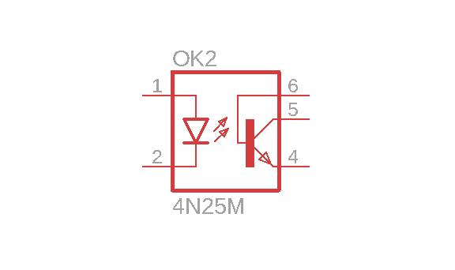
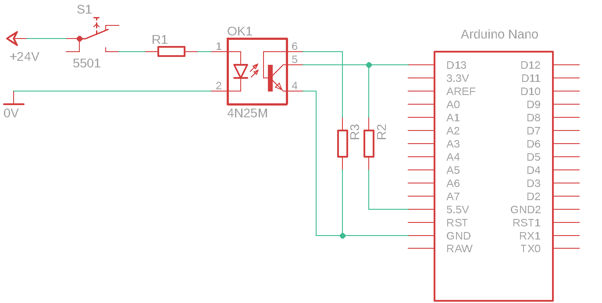

# Optosklopnik in mikrokrmilnik

Galvanska ločitev digitalnih vhodov mikrokrmilnika je potrebna, kadar želimo ohraniti informacijski tok podatkov do krmilnika, vendar želimo ločiti električni tokokrog vira informacij od električnega tokokroga mikrokrmilnika. Galvanska ločitev nudi prilagoditev napetostnih nivojev in zaščito mikrokrmilnika pred električnimi preobremenitvami.

Standardni industrijski napetostni nivo je 24V, kar pomeni, da je za uporabo mikrokrmilnika, ki deluje na napetostnih nivojih 5V ali 3,3V, potrebna napetostna prilagoditev. Ena od možnih rešitev je uporaba optosklopnika.

Optični sklopnik oz. optosklopnik je električni element, ki prevaja digitalno informacijo med dvema električnima tokokrogoma preko svetlobe. Shematična predstavitev optosklopnika je prikazana na sliki.

<figure><figcaption></figcaption></figure>

Optosklopnik ima na vhodu LED na katero priključimo tokokrog vira informacije in na izhodu optični tranzistor na katerega priključimo tokokrog ponora informacije.

Gradnjo električnega vezja pričnemo z izdelavo električne sheme.

## Električna shema

Električna shema vključitve optosklopnika prikazuje slika.

<figure><figcaption>
Uporaba optosklopnika za galvansko ločitev dveh napajalnih virov
</figcaption></figure>

Vhodna LED optosklopnika je povezana preko tipke **S1** in upora **R1** na _24V_ napetostni nivo. Optični tranzistor optosklopnika je povezan na vhod **D12** mikrokrmilnika.


**Pozor!** Električna povezava izhoda optosklopnika in mikrokrmilnika je izvedene z **pull up** uporom, ki invertira logiko delovanja.


Delovanje vezja:

* Ko uporabnik aktivira tipko, steče tok skozi LED optosklopnika in LED začne oddajati svetlobo.
* Ta svetloba nato osvetli optični tranzistor in ga odpre.
* Ko je tranzistor odprt steče tok skozi upor **R2** in potencial **GND** se prenese na vhod mikrokrmilnika, ki predstavlja logično 0 oz. _FALSE_.
* Ko je tranzistor zaprt tok skozi upor **R2** ne teče in na vhodu mikrokrmilnika dobimo visok potencial, ki predstavlja logično 1 oz. _TRUE_.

## Električne komponente

| Komponenta      | Koda         | Proizvajalec | Podatkovni list                                                                                                                                                                                                                 |
| --------------- | ------------ | ------------ | ------------------------------------------------------------------------------------------------------------------------------------------------------------------------------------------------------------------------------- |
| optosklopnik    | 4N25         | Vishay       | [datoteka](https://files.gitbook.com/v0/b/gitbook-x-prod.appspot.com/o/spaces%2FOjZ1XG64rvc2AeRBUH5H%2Fuploads%2FCAMTxKqiihmMlFemcG0r%2F4n25.pdf?alt=media\&token=8988286b-b7b5-46ec-a997-ead3a9f7d1e9)                         |
| mikrokrmilnik   | ATmega328    | Microchip    | [datoteka](https://files.gitbook.com/v0/b/gitbook-x-prod.appspot.com/o/spaces%2FOjZ1XG64rvc2AeRBUH5H%2Fuploads%2FVdyx5L6r6wqAilPGHpen%2FATmega.pdf?alt=media\&token=a7f48452-034e-4411-b859-d87bf77d7454)                       |
| razvojna plošča | Arduino Nano | Gravitech    | [datoteka](https://files.gitbook.com/v0/b/gitbook-x-prod.appspot.com/o/spaces%2FOjZ1XG64rvc2AeRBUH5H%2Fuploads%2FmBK4u5xIBnLKRFzfea5q%2FGravitech\_Arduino\_Nano3\_0.pdf?alt=media\&token=b8cb7c7d-aee0-4845-863b-88c382cca882) |
| upori           | /            | Multicomp    | [datoteka](https://files.gitbook.com/v0/b/gitbook-x-prod.appspot.com/o/spaces%2FOjZ1XG64rvc2AeRBUH5H%2Fuploads%2FwniMD8SuO6uL0i9SD8N2%2Fupor.pdf?alt=media\&token=3553e1a0-af07-4fd2-8af3-615a8cee41e7)                         |

## Dimenzioniranje komponent

### Upor R1

Pri izračunu upora R1 si pomagajte z [gradivom](led-in-mikrokrmilnik.md)

### Upor R2

Pri izračunu upora R2 si pomagajte z [gradivom](<../README (1).md>)

### Upor R3

Optosklopnik **4n25** ima dodatno električno povezavo baze optičnega tranzistorja na pin _6_. To povezavo lahko vzporedno uporabimo kot dodatno možnost odpiranja optosklopnika. V tem primeru te možnosti ne bomo uporabljali in bomo to povezavo vezali preko upora R3 na negativni potencial. Nepovezana povezava se obnaša kot antena, ki sprejema elektromagnetno sevanje iz okolice, kar povzroča nenadzorovano odpiranje optičnega tranzistorja. Pri izračunu vrednosti upora R3 si pomagajte z [gradivom](<../README (1).md#dimenzioniranje-komponent>)
