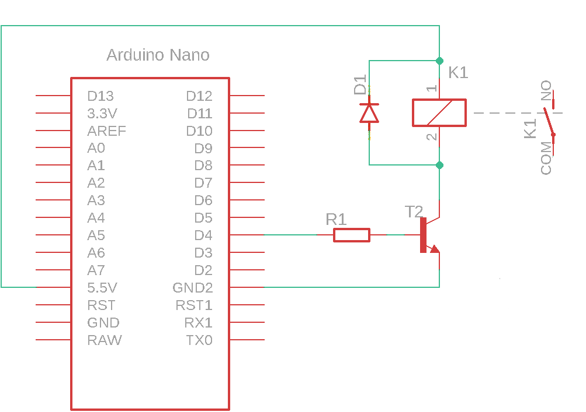
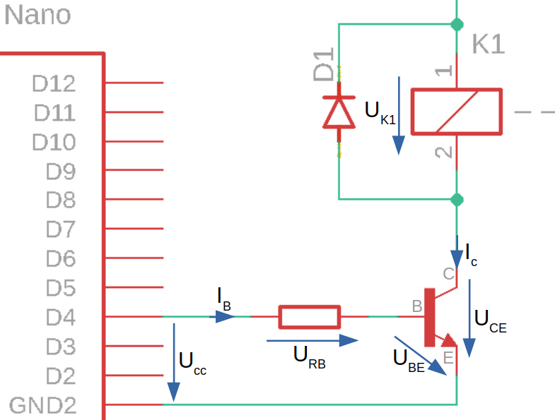
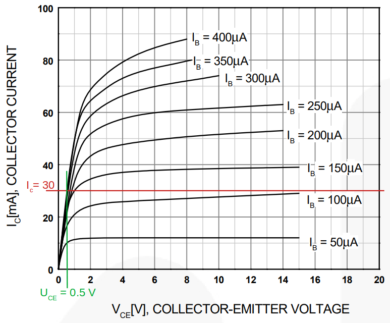

# Rele in mikrokrmilnik

Rele omogoča galvansko ločitev krmilnega in bremenskega tokokroga, ki je nujna v primerih ko:

* imamo breme z induktivnim značajem, ki pri vklopu in izklopu povzroča inducirane tokove, ki ogrožajo digitalni izhod mikrokrmilnika
* ko se nazivna napetost bremena razlikuje od napetosti digitalnega izhoda
* ko je obratovalna moč bremena višja kot izhodna moč digitalnega izhoda

Gradnjo električnega vezja pričnemo z izdelavo električne sheme.

## Električna shema

Električna shema vključitve releja prikazuje slika.

<figure><figcaption></figcaption></figure>

Digitalni pin **D4** mikrokrmilnika je povezan preko upora **R1** na bazo tranzistorja. Tuljava releja **K1** je povezana v tokokrog mikrokrmilnika in je krmiljena s tranzistorjem. Tuljava ima vzporedno vezano zaščitno diodo **D1**.

Delovanje vezja:

* Ko mikrokrmilnik aktivira digitalni izhod steče tok v bazo tranzistorja in ga odpre
* Odprt tranzistor požene tok skozi tuljavo releje in aktivira rele
* Aktiviran rele sklene kontakt **K1**

## Električne komponente

| Komponenta      | Koda         | Proizvajalec     | Podatkovni list                                                                                                                                                                                                                 |
| --------------- | ------------ | ---------------- | ------------------------------------------------------------------------------------------------------------------------------------------------------------------------------------------------------------------------------- |
| Rele            | V23105       | AXICOM           | [datoteka](https://files.gitbook.com/v0/b/gitbook-x-prod.appspot.com/o/spaces%2FOjZ1XG64rvc2AeRBUH5H%2Fuploads%2FNozBDqjgGq8wwq5ogwFr%2FreleyV23105.pdf?alt=media\&token=6e9614c8-4e16-4238-b2bd-0e36a72d839d)                  |
| tranzistor      | BC550        | ON Semiconductor | [datoteka](https://files.gitbook.com/v0/b/gitbook-x-prod.appspot.com/o/spaces%2FOjZ1XG64rvc2AeRBUH5H%2Fuploads%2FNkIToA5TJdzhLiJa8uWY%2FtranBC550.pdf?alt=media\&token=64e3614f-356d-40e2-867e-8471feb14908)                    |
| dioda           | 1N4007       | FairChild        | [datoteka](https://files.gitbook.com/v0/b/gitbook-x-prod.appspot.com/o/spaces%2FOjZ1XG64rvc2AeRBUH5H%2Fuploads%2FVo1DGisQWbUp2fduCfXv%2F1N4007-471020.pdf?alt=media\&token=9852369f-aa20-4b5d-80e7-1aeb8fe76d6a)                |
| mikrokrmilnik   | ATmega328    | Microchip        | [datoteka](https://files.gitbook.com/v0/b/gitbook-x-prod.appspot.com/o/spaces%2FOjZ1XG64rvc2AeRBUH5H%2Fuploads%2FVdyx5L6r6wqAilPGHpen%2FATmega.pdf?alt=media\&token=a7f48452-034e-4411-b859-d87bf77d7454)                       |
| razvojna plošča | Arduino Nano | Gravitech        | [datoteka](https://files.gitbook.com/v0/b/gitbook-x-prod.appspot.com/o/spaces%2FOjZ1XG64rvc2AeRBUH5H%2Fuploads%2FmBK4u5xIBnLKRFzfea5q%2FGravitech\_Arduino\_Nano3\_0.pdf?alt=media\&token=b8cb7c7d-aee0-4845-863b-88c382cca882) |
| upor            | /            | Multicomp        | [datoteka](https://files.gitbook.com/v0/b/gitbook-x-prod.appspot.com/o/spaces%2FOjZ1XG64rvc2AeRBUH5H%2Fuploads%2FwniMD8SuO6uL0i9SD8N2%2Fupor.pdf?alt=media\&token=3553e1a0-af07-4fd2-8af3-615a8cee41e7)                         |

## Dimenzioniranje komponent

Pri dimenzioniranju komponent si pomagamo s shemo na sliki, ki prikazuje električne veličine vezja.

<figure><figcaption>
Električne veličine za izračun komponent
</figcaption></figure>

### Bazni upor $$R_B$$ &#x20;

Bazni upor $$R_B$$ določa t.i. odprtje tranzistorja, kar pomeni, bolj kot je tranzistor odprt večji tok lahko steče skoz njega in obratno. Tranzistor je potrebno odpreti toliko, da skozenj steče preklopni tok za aktivacijo releja.

Preklopni tok releja, ki je hkrati tudi kolektorski tok skozi tranzistor $$I_C$$, izračunamo iz podatka o moči tuljave, ki je v našem primeru $$150 mW$$.

$$
I_{preklopa}=I_{C}=\frac{P_{tuljave}}{U_{nazivna}}=\frac{150 mW}{5 V}=30 mA
$$

Iz preklopnega toka določimo potrebni bazni tok z uporabo vhodno izhodne karakteristike tranzsitorja

<figure><figcaption></figcaption></figure>

Karakteristika tranzistorja popisuje odvisnost napetosti $$U_{CE}$$ in toka $$I_C$$ v odvisnosti od baznega toka $$I_B$$. Ker tranzistor uporabljamo kot stikalo želimo, da v odprtem stanju porablja čim manj električne energije. Bolj kot tranzistor odpremo manj energije bo porabljal v odprtem stanju, zato izberemo najvišji bazni tok $$I_B = 400 \mu A$$

Presečišče krivulje izbranega baznega toka in preklopnega toka releja določa delovno točko tranzistorja v odprtem stanju. Iz nje preberemo vrednost padca napetosti na tranzistorju $$U_{CE} = 0,5V$$

Velikost baznega upora $$R_B$$ določimo po enačbi:

$$
R_1=\frac{U_{CC}-U_{BE}}{I_B}
$$

Napetost $$U_{BE}$$ predstavlja padec napetosti na pn spoju tranzistorja in je odvisna od izvedbe tranzistorja (za silicijevo tehnologijo je ta vrednost približno $$0,7 V$$). Točen podatek pa preberemo iz podatkovnega lista tranzistorja

$$
U_{BE}=0.7V
$$

Izračunana vrednost baznega upora je tako

$$
R_B=\frac{5V - 0.7V}{400 \mu A} \approx 10 k\Omega
$$

### Rele

Pri izbiri releja moramo upoštevati vrednost napetosti visokega potenciala digitalnega izhoda izbranega mikrokrmilnika, ki znaša v našem primeru $$5V$$. Ker bomo preko tranzistorja zagotavljali preklopni tok za aktivacijo releja, tokovne omejitve digitalnega izhoda ni potrebno upoštevati.

Preverimo ali padec napetosti $$U_{CE}$$, ki zmanjšuje napetost na tuljavi releja vpliva na njegov preklop. Nova napetost na tuljavi releja je tako $$U_{K1} = U_{CC}-U_{CE}=5V-0,5V=4,5V$$Po pregledu podatkovnega lista za rele ugotovimo, da je minimalna napetost na tuljavi ravno 4,5 V.
