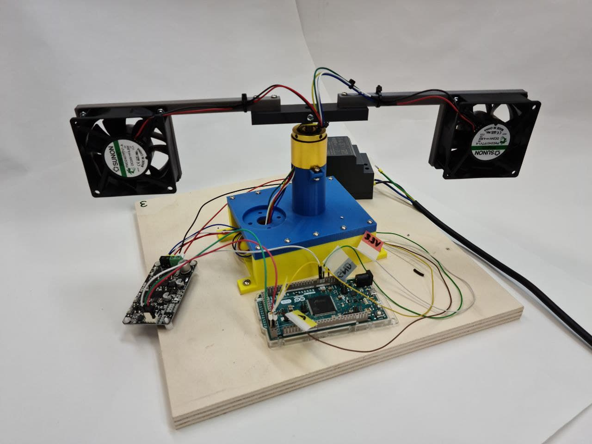
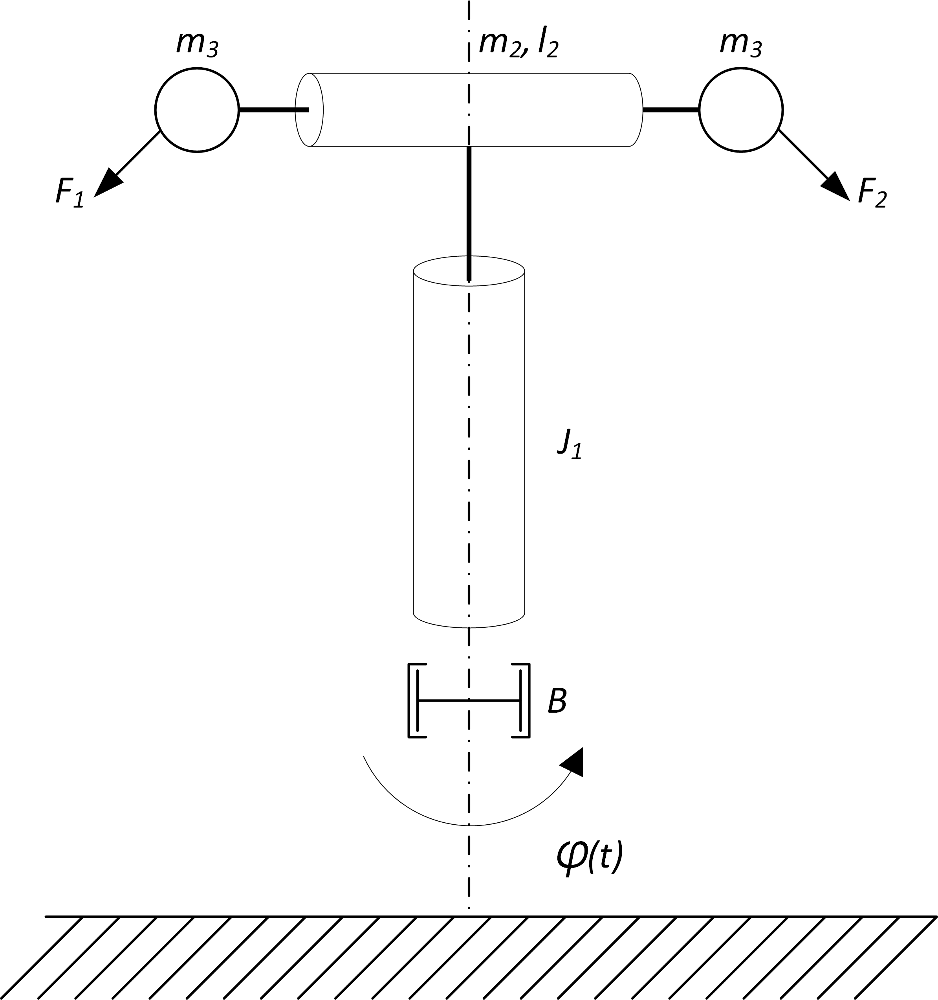

# Aero

<figure><figcaption>
AREO model
</figcaption></figure>

## Description of the model&#x20;

The AERO model is a laboratory device designed for learning about the field of dynamic system control. The device consists of a rotating crossbeam to which two fan drives are attached, propelling the beam in a horizontal plane. A rotation angle sensor tracks the movement of the beam's rotation. The model is composed of the following components:

* mechanical device
* rotation angle sensor
* fan drive
* motor controller
* microcontroller (Arduino Due)
* microcomputer (RaspberryPi) The components are connected as shown in the block diagram.

## Mechanical Device

The device is a rotating mechanical dynamic system. It is schematically shown in the picture.

<figure><figcaption>
Shema masnega modela makete
</figcaption></figure>

The device consists of a beam that rotates around a vertical axis. At both ends of the rotating beam, there is one fan drive attached, represented by the dotted mass $$m_3$$. The twist of the vertical axis is denoted by the angle $$\varphi(t)$$ , and it is driven by the thrust of the fan drives, which create forces $$F_1(t)$$ and $$F_2(t)$$.

* System variables

| Label            | Description                                       | Unit  |
| ---------------- | ------------------------------------------------- | ----- |
| $$F_1$$, $$F_2$$ | The force that causes the rotation of the device. | $$N$$ |
| $$\varphi$$      | Angle of rotation of the vertical axis            | $$°$$ |

* System parameters

| Label   | Description                            | Value     | Unit           |
| ------- | -------------------------------------- | --------- | -------------- |
| $$B$$   | Damping of the vertical axis           | $$0.001$$ | $$kg/s$$       |
| $$J_1$$ | Moment of inertia of the vertical axis | $$0.29$$  | $$g \cdot m²$$ |
| $$m_2$$ | Mass of the crossbeam                  | $$90$$    | $$g$$          |
| $$l_2$$ | Length of the horizontal part          | $$32$$    | $$cm$$         |
| $$m_3$$ | Mass of the fan drive                  | $$90$$    | $$g$$          |

## Angle Sensor (Rotary Encoder)

The vertical axis is equipped with an angle or rotation sensor. Installed is a magnetic incremental encoder [RLS AM4096](https://files.gitbook.com/v0/b/gitbook-x-prod.appspot.com/o/spaces%2FOjZ1XG64rvc2AeRBUH5H%2Fuploads%2FyzCheUulIy3s2L2ZKiW7%2FAM4096D02\_09.pdf?alt=media\&token=98176deb-bbd0-47c8-8e04-4e16f1c4bee7) from the Slovenian company [RLS d.o.o.](https://www.rls.si/) The sensor measures the relative movement of the axis and conveys the information in the form of a digital signal to the microcontroller.

