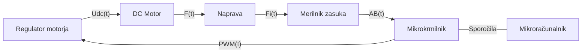

# Aero

<figure><figcaption><p>AREO maketa</p></figcaption></figure>

## Opis makete

Maketa AERO je laboratorijska naprava namenjena spoznavanju področja vodenja dinamičnih sistemov. Napravo sestavlja rotirajoči prečni nosilec na katerega sta pritrjena dva ventilatorska pogona, ki poganjata nosilec v horizontalni ravnini. Merilnik kota sledi gibanju rotacije nosilca.

Maketo sestavljajo naslednji gradniki:

* mehanska naprava
* merilnik zasuka
* ventilatorski pogon
* regulator motorja
* mikrokrmilnik (Arduino Due)
* mikroračunalnik (RaspberryPi)

Gradniki so povezani kot prikazuje blokovna shema



### Mehanska naprava

Naprava je rotirajoči mehanski dinamičen sistem. Shematično je prikazan na sliki

<figure><figcaption><p>Shema masnega modela makete</p></figcaption></figure>

Napravo sestavlja tram, ki rotira okoli vertikalne osi. Na obeh koncih rotirajočega trama je pritrjen po en ventilatorski pogon, ki je ponazorjen s točkasto maso $m\_3$. Zasuk vertikalne osi označuje kot $varphi(t)$, poganja pa ga potisk ventilatorskih pogonov, ki ustvarjata sili $F\_1(t)$ in $F\_2(t)$.

* Spremenljivke sistema

| Oznaka           | Opis                               | Enota |
| ---------------- | ---------------------------------- | ----- |
| $$F_1$$, $$F_2$$ | Sila, ki povzroča rotacijo naprave | $$N$$ |
| $$\varphi$$      | Kot rotacije vertikalne osi        | $$°$$ |

* Parametri sistema

| Oznaka  | Opis                              | Vrednost  | Enota          |
| ------- | --------------------------------- | --------- | -------------- |
| $$B$$   | Dušenje vertikalne osi            | $$0.001$$ | $$kg/s$$       |
| $$J_1$$ | Vztrajnosti moment vertikalne osi | $$0.29$$  | $$g \cdot m²$$ |
| $$m_2$$ | Masa prečnega trama               | $$90$$    | $$g$$          |
| $$l_2$$ | Dolžina horizontalnega telesa     | $$32$$    | $$cm$$         |
| $$m_3$$ | Masa ventilatorskega pogona       | $$90$$    | $$g$$          |

### Merilnik zasuka

Vertikalna os je opremljena z merilnikom zasuka oz. kota. Nameščen je magnetni inkrementalni enkoder RLS AM4096 slovenskega podjetja [RLS d.o.o.](https://www.rls.si/). Merilnik meri relativno gibanje osi ter posreduje informacijo v obliki digitalnega signala mikrokrmilniku. Praktičen primer uporabe takega merilnika je dostopen v gradivu.

### Ventilatorski pogon

Obračanje naprave okoli osi dosežemo z dvema enakima ventilatorskima pogonoma, kjer vsak ventilator poganja napravo v eno smer in s tem spreminja kot $$\varphi$$. Podatkovni list ventilatorskega pogona

### Gonilnik ventilatorskega pogona

Za pogon enosmernega motorja skrbi motorski gonilnik MD10C R3 podjetja [Cytron](https://www.cytron.io/).

Gonilnik je povezan na dva pogona na način, ki omogoča dvosmerno vrtenje naprave. S spreminjanjem polaritete izhoda gonilnika se ne obrača smer vrtenja pogonov, ampak se izmenjujeta delovanja enega in druge pogona. Gonilnik upravljamo z dvema digitalnima signaloma $$power$$ in $$direction$$. $$power$$ signal predstavlja PWM (Pulse Width Modulation) moduliran signal $$direction$$ pa polariteto napetostnega izhoda. Praktičen primer krmiljenje gonilnika je dostopen v gradivu.

Karakteristiko sile potiska v odvisnosti od nastavitve PWM signala gonilnika opisuje tabela.

| PWM (od 255) | F\[N] |
| ------------ | ----- |
| 0-175        | 0     |
| 180          | 0.013 |
| 185          | 0.030 |
| 190          | 0.036 |
| 195          | 0.043 |
| 200          | 0.050 |
| 205          | 0.053 |
| 210          | 0.060 |
| 215          | 0.063 |
| 220          | 0.066 |
| 225          | 0.072 |
| 230          | 0.080 |
| 235          | 0.085 |
| 240          | 0.087 |
| 245          | 0.090 |
| 250          | 0.092 |
| 255          | 0.095 |

### Mikrokrmilnik

Uporabljen je mikrokrmilnik ARM, ki je vpet na razvojni plošči ArduinoDue.

### Mikroračunalnik

Uporabljen je mikroračunalnik RaspberryPi 4B, ki komunicira preko serijske komunikacije z razvojno ploščo ArduinoDue. Mikroračunalnik tudi poganja strežnik, ki skrbi za grafični vmesnik, preko katerega lahko upornik spremlja in upravlja maketo.

## Električni del

Električna shema naprave povezuje arduino mikrokrmilnik z dvema inkrementalnima dajalnikoma in regulatorjem enosmernega motorja. Serijska povezave med mikrokrmilnikom in mikroračunalnikom ni prikazana.

Povezave digitalnih signalov z Arduinom so predstavljene v tabeli

| Naprava  | Pin | Arduino Pin | Oznaka povezave | vhod/izhod |
| -------- | --- | ----------- | --------------- | ---------- |
| RMK4 Fi  | A   | 22          | A1              | vhod       |
| RMK4 Fi  | B   | 23          | B1              | vhod       |
| MD10C-R3 | DIR | 2           | DIR             | izhod      |
| MD10C-R3 | PWM | 3           | PWM             | izhod      |

### Električne komponente

Seznam vse uporabljenih električnih komponent:

| Komponenta                      | Oznaka             | Proizvajalec                                | Podatkovni list |
| ------------------------------- | ------------------ | ------------------------------------------- | --------------- |
| inkrementalni dajalnik          | RLS AM4096         | [RLS d.o.o.](https://www.rls.si/)           | datoteka        |
| gonilnik ventilatorskih pogonov | MD10C R3           | [Cytron](https://www.cytron.io/)            | datoteka        |
| mikrokrmilnik                   | SAM3X8E ARM        | [Microchip](https://www.microchip.com/)     | datoteka        |
| razvojna plošča                 | Arduino Due        | [Arduino](https://www.arduino.cc/)          | datoteka        |
| mikroračunalnik                 | RaspberryPi 4B 4GB | [RaspberryPi](https://www.raspberrypi.org/) | datoteka        |

## Programski del

Mikrokrmilnik mora:

* dekodirat signal dajalnika ter ga pretvarjati v kot
* generirati PWM signal za krmiljenje motorja
* izvajati regulacijske algoritme

Predstavljen je vzorec programa, ki vsebuje vse elemente vendar ga je potrebno ustrezno dopolniti. Vzorčni program če ga poženete na napravi bo deloval po naslednji sekvenci:

* 5 sekund sekund miruje
* 5 sekund se vrti v eno smer
* 5 sekund se vrti v drugo smer
* nato miruje dalje Med delovanjem bo po serijski komunikaciji sporočal podatke o kotu, pwm, smeri vrtenja, stanju, in števcu.

```c
// knjižnica za izvedbo prekinitvene rutine
#include <DueTimer.h>
// knjižnica za izvedbo konzolnega programskega vmesnika

// definicija pina za enkoder kanal A
#define pinEncoderA  22
// definicija pina za enkoder kanal B
#define pinEncoderB  23
// definicija pina za določanje smeri vrtenja
#define pinDir 2
// definicija pina za PWM signal
#define pinPwm 3

// seznam parametrov sistema
// čas vzorčenja v us
int ts = 10000;
// razmernik pwm signala
float dcyc = 0;
// smer vrtenja
int dir = 0;
// spremenljivka za beleženje kota v korakih
int encoderPos = 0;
// spremenljivka stanja
int state = 0;
// spremenljivka števca za izvedbo časovnika
int counter = 0;


void setup() {
  // inicializacija serijskega vmesnika
  Serial.begin(115200);

  //****************************************GONILNIŠE NASTAVITVE****************************************
  pinMode(pinDir, OUTPUT);


  //****************************************VZORČENJE***************************************************
  // nastavitev časovnika za proženje prekinitvene rutine
  Timer3.attachInterrupt(sampling_task).start(ts);

  //****************************************ENKODER polovična ločljivost********************************
  // definicija vhodnih signalov enkoderja
  pinMode(pinEncoderA, INPUT);
  pinMode(pinEncoderB, INPUT);

  // prekinitvna rutina, ki se proži ob spremembi stanja signala A
  attachInterrupt(digitalPinToInterrupt(pinEncoderA), doEncoderA, CHANGE);
}

void loop() {
  //Izpis podatka o kotu in pwm vsako sekundo
  Serial.print("pozicija: ");
  Serial.print(encoderPos);
  Serial.print(" pwm: ");
  Serial.print(dcyc);
  Serial.print(" dir: ");
  Serial.println(dir);

  Serial.print("state: ");
  Serial.print(state);
  Serial.print(" counter:");
  Serial.println(counter);
  delay(1000);
}

// prekinitvena rutina, ki se proži na vsakih Ts ms
void sampling_task() {
  // izvajanje korakov avtomata
  switch (state) {
    //Stanje 0 sistem miruje 10s
    case 0: {
        counter++;
        //Izpolnjen pogoj pomeni, da je preteklo 5s
        if (counter > 500) {
          dcyc = 240;
          dir = 0;
          counter = 0;
          state = 1;
        }
      }
      break;
    //Stanje 1 sistem vrti naprej 5s
    case 1: {
        counter++;
        //Izpolnjen pogoj pomeni, da je preteklo 5s
        if (counter > 500) {
          dcyc = 240;
          dir = 1;
          counter = 0;
          state = 2;
        }
      }

      break;
    //Stanje 2 sistem vrti nazaj 5s
    case 2: {
        counter++;
        //Izpolnjen pogoj pomeni, da je preteklo 5s
        if (counter > 500) {
          dcyc = 0;
          dir = 0;
          counter = 0;
          state = 3;
        }
      }
      break;
    //Stanje 3 sistem se ustavi
    case 3: {
      }
      break;
  }
  //Zapis izhodnih vrednosti
  analogWrite(pinPwm, dcyc);
  digitalWrite(pinDir, dir);
}

// prekinitvena rutina signala A
void doEncoderA() {
  // ali je bila prekinitev posledica prehoda signala iz logične 0 na 1 ali obratno
  if (digitalRead(pinEncoderA) == HIGH) {
    // preverimo signal B da ugotovimo smer premikanja osi
    if (digitalRead(pinEncoderB) == LOW) {
      encoderPos++ ;
    }
    else {
      encoderPos--;
    }
  }
  else
  {
    // preverimo signal B da ugotovimo smer premikanja osi
    if (digitalRead(pinEncoderB) == HIGH) {
      encoderPos++;
    }
    else {
      encoderPos--;
    }
  }
}
```
