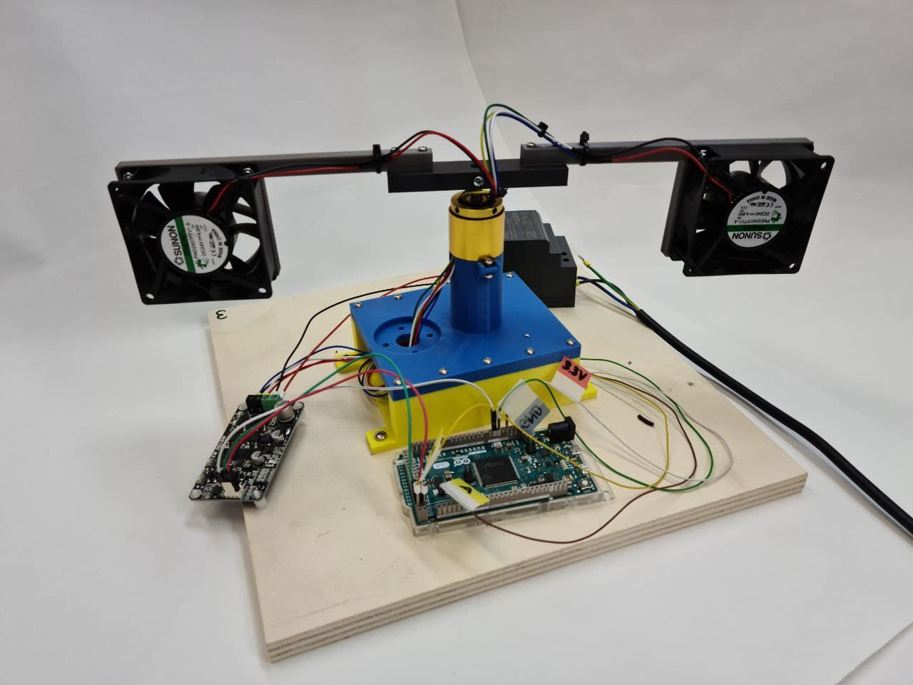
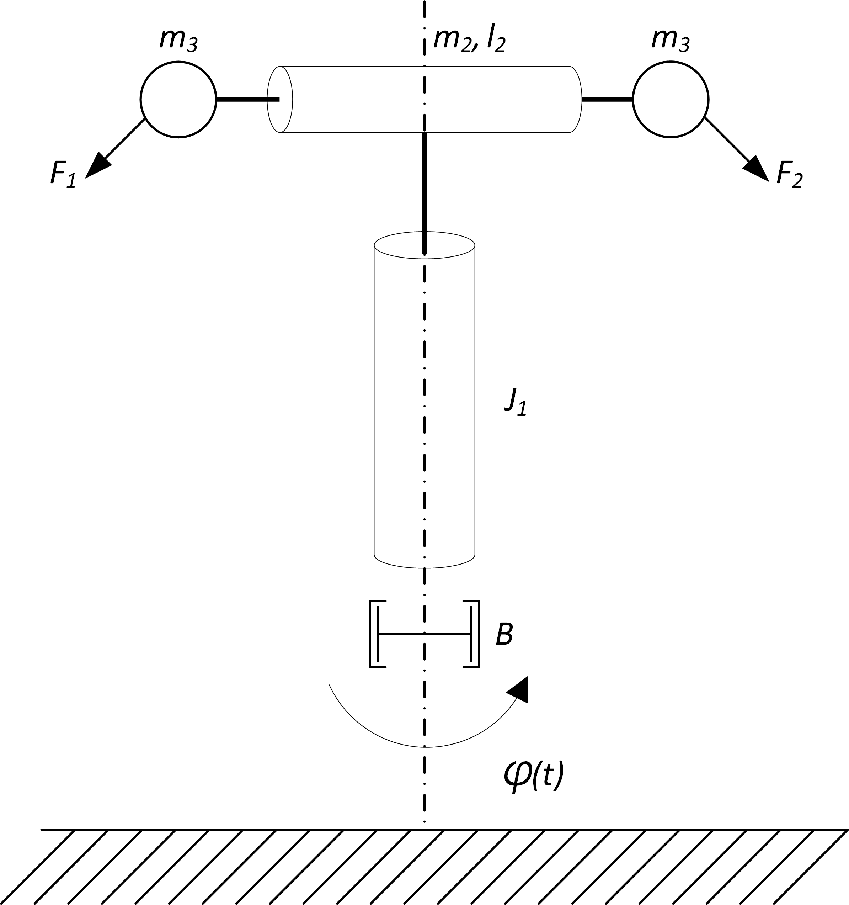

# Aero

<figure><figcaption>
AREO maketa
</figcaption></figure>

## Opis makete

Maketa AERO je laboratorijska naprava namenjena spoznavanju področja vodenja dinamičnih sistemov. Napravo sestavlja rotirajoči prečni nosilec na katerega sta pritrjena dva ventilatorska pogona, ki poganjata nosilec v horizontalni ravnini. Merilnik kota sledi gibanju rotacije nosilca.

Maketo sestavljajo naslednji gradniki:

* mehanska naprava
* merilnik zasuka
* ventilatorski pogon
* regulator motorja
* mikrokrmilnik (Arduino Due)
* mikroračunalnik (RaspberryPi)

Gradniki so povezani kot prikazuje blokovna shema

### Mehanska naprava

Naprava je rotirajoči mehanski dinamičen sistem. Shematično je prikazan na sliki

<figure><figcaption>
Shema masnega modela makete
</figcaption></figure>

Napravo sestavlja tram, ki rotira okoli vertikalne osi. Na obeh koncih rotirajočega trama je pritrjen po en ventilatorski pogon, ki je ponazorjen s točkasto maso $m\_3$. Zasuk vertikalne osi označuje kot $$varphi(t)$$, poganja pa ga potisk ventilatorskih pogonov, ki ustvarjata sili $$F_1(t)$$ in $$F_2(t)$$.

* Spremenljivke sistema

| Oznaka           | Opis                               | Enota |
| ---------------- | ---------------------------------- | ----- |
| $$F_1$$, $$F_2$$ | Sila, ki povzroča rotacijo naprave | $$N$$ |
| $$\varphi$$      | Kot rotacije vertikalne osi        | $$°$$ |

* Parametri sistema

| Oznaka  | Opis                              | Vrednost  | Enota          |
| ------- | --------------------------------- | --------- | -------------- |
| $$B$$   | Dušenje vertikalne osi            | $$0.001$$ | $$kg/s$$       |
| $$J_1$$ | Vztrajnosti moment vertikalne osi | $$0.29$$  | $$g \cdot m²$$ |
| $$m_2$$ | Masa prečnega trama               | $$90$$    | $$g$$          |
| $$l_2$$ | Dolžina horizontalnega telesa     | $$32$$    | $$cm$$         |
| $$m_3$$ | Masa ventilatorskega pogona       | $$90$$    | $$g$$          |

### Merilnik zasuka

Vertikalna os je opremljena z merilnikom zasuka oz. kota. Nameščen je magnetni inkrementalni enkoder [RLS AM4096](https://files.gitbook.com/v0/b/gitbook-x-prod.appspot.com/o/spaces%2FOjZ1XG64rvc2AeRBUH5H%2Fuploads%2FyzCheUulIy3s2L2ZKiW7%2FAM4096D02\_09.pdf?alt=media\&token=98176deb-bbd0-47c8-8e04-4e16f1c4bee7) slovenskega podjetja [RLS d.o.o.](https://www.rls.si/). Merilnik meri relativno gibanje osi ter posreduje informacijo v obliki digitalnega signala mikrokrmilniku. V tabeli so predstavljeni signali merilnika in barve žic, po katerih tečejo signali (to velja samo za to maketo in ne za merilnik na splošno)

| Oznaka  | Opis                          | Barva žice | Vhod/Izhod |
| ------- | ----------------------------- | ---------- | ---------- |
| Vcc     | Napajanje 3.3V ali 5V         | bela       | Vhod       |
| GND     | Negativni potencial napajanje | zelena     | Vhod       |
| A       | Enkoderski digitalni signal A | rjava      | Izhod      |
| B       | Enkoderski digitalni signal B | rumena     | Izhod      |
| Vang    | Enkoderski analogni signal    | modra      | Izhod      |

### Ventilatorski pogon

Obračanje naprave okoli osi dosežemo z dvema enakima ventilatorskima pogonoma, kjer vsak ventilator poganja napravo v eno smer in s tem spreminja kot $$\varphi$$. Podatkovni list ventilatorskega pogona

### Gonilnik ventilatorskega pogona

Za pogon enosmernega motorja skrbi motorski gonilnik MD10C R3 podjetja [Cytron](https://www.cytron.io/).

Gonilnik je povezan na dva pogona na način, ki omogoča dvosmerno vrtenje naprave. S spreminjanjem polaritete izhoda gonilnika se ne obrača smer vrtenja pogonov, ampak se izmenjujeta delovanja enega in druge pogona. Gonilnik upravljamo z dvema digitalnima signaloma $$power$$ in $$direction$$. $$power$$ signal predstavlja PWM (Pulse Width Modulation) moduliran signal $$direction$$ pa polariteto napetostnega izhoda. Praktičen primer krmiljenje gonilnika je dostopen v gradivu.

Karakteristiko sile potiska v odvisnosti od nastavitve PWM signala gonilnika opisuje tabela.

| PWM (od 255) | F\[N] |
| ------------ | ----- |
| 0-175        | 0     |
| 180          | 0.013 |
| 185          | 0.030 |
| 190          | 0.036 |
| 195          | 0.043 |
| 200          | 0.050 |
| 205          | 0.053 |
| 210          | 0.060 |
| 215          | 0.063 |
| 220          | 0.066 |
| 225          | 0.072 |
| 230          | 0.080 |
| 235          | 0.085 |
| 240          | 0.087 |
| 245          | 0.090 |
| 250          | 0.092 |
| 255          | 0.095 |

### Mikrokrmilnik

Uporabljen je mikrokrmilnik ARM, ki je vpet na razvojni plošči ArduinoDue.

### Mikroračunalnik

Uporabljen je mikroračunalnik RaspberryPi 4B, ki komunicira preko serijske komunikacije z razvojno ploščo ArduinoDue. Mikroračunalnik tudi poganja strežnik, ki skrbi za grafični vmesnik, preko katerega lahko upornik spremlja in upravlja maketo.

## Električni del

Električna shema naprave povezuje arduino mikrokrmilnik z dvema inkrementalnima dajalnikoma in regulatorjem enosmernega motorja. Serijska povezave med mikrokrmilnikom in mikroračunalnikom ni prikazana.

Povezave digitalnih signalov z Arduinom so predstavljene v tabeli

| Naprava  | Pin | Arduino Pin | Oznaka povezave | vhod/izhod |
| -------- | --- | ----------- | --------------- | ---------- |
| RMK4 Fi  | A   | 22          | A1              | vhod       |
| RMK4 Fi  | B   | 23          | B1              | vhod       |
| MD10C-R3 | DIR | 2           | DIR             | izhod      |
| MD10C-R3 | PWM | 3           | PWM             | izhod      |

### Električne komponente

Seznam vse uporabljenih električnih komponent:

| Komponenta                      | Oznaka             | Proizvajalec                                | Podatkovni list                                                                                                                                                                                                  |
| ------------------------------- | ------------------ | ------------------------------------------- | ---------------------------------------------------------------------------------------------------------------------------------------------------------------------------------------------------------------- |
| inkrementalni dajalnik          | RLS AM4096         | [RLS d.o.o.](https://www.rls.si/)           | [datoteka](https://files.gitbook.com/v0/b/gitbook-x-prod.appspot.com/o/spaces%2FOjZ1XG64rvc2AeRBUH5H%2Fuploads%2FyzCheUulIy3s2L2ZKiW7%2FAM4096D02\_09.pdf?alt=media\&token=98176deb-bbd0-47c8-8e04-4e16f1c4bee7) |
| gonilnik ventilatorskih pogonov | MD10C R3           | [Cytron](https://www.cytron.io/)            | datoteka                                                                                                                                                                                                         |
| mikrokrmilnik                   | SAM3X8E ARM        | [Microchip](https://www.microchip.com/)     | datoteka                                                                                                                                                                                                         |
| razvojna plošča                 | Arduino Due        | [Arduino](https://www.arduino.cc/)          | datoteka                                                                                                                                                                                                         |
| mikroračunalnik                 | RaspberryPi 4B 4GB | [RaspberryPi](https://www.raspberrypi.org/) | datoteka                                                                                                                                                                                                         |

