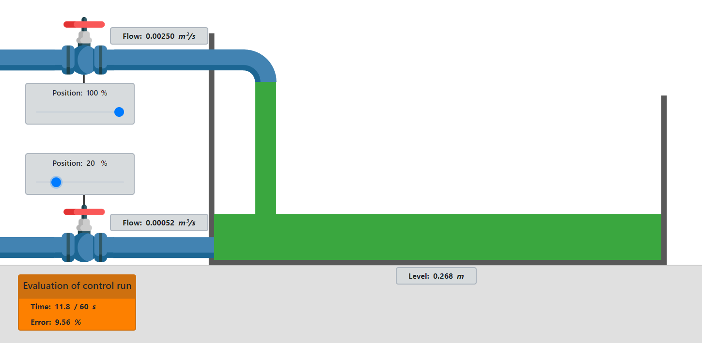

# FlexDrive

<figure><figcaption>
FlexDrive maketa
</figcaption></figure>

### Opis makete

Maketa FlexDrive je laboratorijska naprava namenjena za podrobno raziskovanje in razumevanje mehanike elastično sklopljenih pogonskih sistemov. Mehanski del naprave sestavljati dve gredi ki sta preko elastične sklopke mehko vpeti. Na vpeti gredi je togo pritrjen vztrajnik na gnani gredi pa je togo pritrjen elektro motor, ki poganja celoten sklop. Blokovna shema prikazuje vse elemente v obliki blokov in signale ki jih povezujejo

<figure><figcaption>
Bločna shema makete
</figcaption></figure>

Bloki makete:

* mehanska naprava
* merilnik zasuka na gnani gredi (Drive shaft)
* merilnik zasuka na vpeti gredi (Load shaft)
* DC motor
* gonilnik motorja
* mikrokrmilnik
* računalnik

Signali makete:

* $$U_{DC}$$ zvezni napetostni signal za pogon DC motorja
* $$M(t)$$ navor ki ga motor dovaja na gnano gred
* $$\phi_1(t)$$zasuk vpete gredi
* $$\phi_2(t)$$zasuk gnane gredi
* $$AB(t)$$kvadratični signal enkoderja
* $$U_{an}$$analogni signal enkoderja (samo vpeta gred)
* $$PWM(t)$$digitalni signal za komunikacijo z gonilnikom motorja

### Mehanska naprava

Mehanska naprava je rotirajoči dinamičen sistem in je shematično prikazan na sliki

<figure><figcaption>
Shema mehanskega dela makete
</figcaption></figure>

Napravo sestavljajo vpeta os, ki z vztrajnostjo $$J_2$$. Na vpeto os je togo pritrjen vztrajnih z vztrajnostjo $$J_1$$. Os je v podnožje vpeta preko dveh ležajev s skupnim dušenjem $$B_1$$. Gibanje vpete osi opisuje kot $$\phi_2(t)$$. Vpeta os je preko vzmetne sklopke s konstano $$k$$ mehko povezna na gnano os, katere vztrajnostni moment podaja $$J_3$$. Gnana os je togo vpeta na motor z dušenjem $$B_2$$. Gibanje gnane osi opisuje kot $$\phi_1(t)$$, navor $$M(t)$$pa dovaja elektro motor.

* Spremenljivke sistema

| Oznaka                                       | Opis                               | Enota  |
| -------------------------------------------- | ---------------------------------- | ------ |
| 
M(t)

 | Navor, ki ga povzroča elektromotor | $$Nm$$ |
| $$\phi_1$$                                   | Kot rotacije gnane osi             | °      |
| $$\phi_2$$                                   | Kot rotacije vpeto osi             | °      |

* Parametri sistema

| Oznaka  | Opis                          | Vrednost | Enota          |
| ------- | ----------------------------- | -------- | -------------- |
| $$B_1$$ | Dušenje vpete osi             |          | $$kg/s$$       |
| $$B_2$$ | Dušenje gnane osi             |          | $$kg/s$$       |
| $$J_1$$ | Vztrajnosti moment vztrjanika | 0.612    | $$g \cdot m²$$ |
| $$J_2$$ | Vztrajnostni moment vpete osi | 0.0902   | $$g \cdot m²$$ |
| $$J_3$$ | Vztrajnostni moment gnane osi | \~0      | $$g \cdot m²$$ |
| $$k$$   | konstanta vzmeti              |          | $$N/m$$        |

### Merilnik zasuka gnana gred

Vertikalna os je opremljena z merilnikom zasuka oz. kota. Nameščen je magnetni inkrementalni enkoder [RLS AM4096](https://files.gitbook.com/v0/b/gitbook-x-prod.appspot.com/o/spaces%2FOjZ1XG64rvc2AeRBUH5H%2Fuploads%2FyzCheUulIy3s2L2ZKiW7%2FAM4096D02\_09.pdf?alt=media\&token=98176deb-bbd0-47c8-8e04-4e16f1c4bee7) slovenskega podjetja [RLS d.o.o.](https://www.rls.si/). Merilnik je nameščen na razvojni ploščici [RMK-AM4096](https://files.gitbook.com/v0/b/gitbook-x-prod.appspot.com/o/spaces%2FOjZ1XG64rvc2AeRBUH5H%2Fuploads%2FbyXYN1jzgBNJ6AE5CL2T%2FRMK4D01\_02.pdf?alt=media\&token=79a8c043-1cb3-4de8-b4c9-b0015d1d1cb4). Merilnik meri relativno gibanje osi ter posreduje informacijo v obliki digitalnega signala mikrokrmilniku. V tabeli so predstavljeni signali merilnika in barve žic, po katerih tečejo signali (to velja samo za to maketo in ne za merilnik na splošno)

| Oznaka  | Opis                          | Barva žice | Vhod/Izhod |
| ------- | ----------------------------- | ---------- | ---------- |
| Vcc     | Napajanje 3.3V ali 5V         | bela       | Vhod       |
| GND     | Negativni potencial napajanje | zelena     | Vhod       |
| A       | Enkoderski digitalni signal A | rjava      | Izhod      |
| B       | Enkoderski digitalni signal B | rumena     | Izhod      |
| Vang    | Enkoderski analogni signal    | modra      | Izhod      |

### Merilnik zasuka vpeta gred

### Elektromotorski pogon

Vrtenje vpete osi dosežemo z elektromotorjem. Maketa ima vgrajen elektromotor [POLOLU-4883](https://files.gitbook.com/v0/b/gitbook-x-prod.appspot.com/o/spaces%2FOjZ1XG64rvc2AeRBUH5H%2Fuploads%2FFI9ruRMcNiLlxmRKPVba%2Fpololu-25d-metal-gearmotors.pdf?alt=media\&token=f1a4c430-3dc9-469c-b787-b65e03a61922) podjetja [POLOLU](https://www.pololu.com/). Prestavno razmerje motorja je 20.4:1.

### Gonilnik elektromotorja

Za pogon enosmernega motorja skrbi motorski gonilnik[ MD10C R3 ](https://files.gitbook.com/v0/b/gitbook-x-prod.appspot.com/o/spaces%2FOjZ1XG64rvc2AeRBUH5H%2Fuploads%2FsN0uYqGXUT1pKGO2iOuc%2FA1TemgvjKjL.pdf?alt=media\&token=e0621c34-4375-4835-b94b-6c76b18cf1ee)podjetja [Cytron](https://www.cytron.io/). Gonilnik upravljamo z dvema digitalnima signaloma $$power$$ in $$direction$$. Signal $$power$$ predstavlja PWM (Pulse Width Modulation) moduliran signal $$direction$$ pa smer toka na izhodu gonilnika, kar posledično določa smer vrtenja enosmernega elektromotorja.&#x20;

## Električni del

Električna shema naprave povezuje arduino mikrokrmilnik z dvema inkrementalnima dajalnikoma in regulatorjem enosmernega motorja. Serijska povezave med mikrokrmilnikom in mikroračunalnikom ni prikazana.

Povezave digitalnih signalov z Arduinom so predstavljene v tabeli

| Naprava  | Pin | Arduino Pin | Oznaka povezave | vhod/izhod |
| -------- | --- | ----------- | --------------- | ---------- |
| RMK4     | A   | 22          | A1              | vhod       |
| RMK4     | B   | 23          | B1              | vhod       |
| MD10C-R3 | DIR | 2           | DIR             | izhod      |
| MD10C-R3 | PWM | 3           | PWM             | izhod      |

### Električne komponente

Seznam vse uporabljenih električnih komponent:

<table><thead><tr><th>Komponenta</th><th width="461">Oznaka</th><th>Proizvajalec</th><th>Podatkovni list</th></tr></thead><tbody><tr><td>inkrementalni dajalnik</td><td>RLS AM4096</td><td><a href="https://www.rls.si/">RLS d.o.o.</a></td><td><a href="https://files.gitbook.com/v0/b/gitbook-x-prod.appspot.com/o/spaces%2FOjZ1XG64rvc2AeRBUH5H%2Fuploads%2FbyXYN1jzgBNJ6AE5CL2T%2FRMK4D01_02.pdf?alt=media&#x26;token=79a8c043-1cb3-4de8-b4c9-b0015d1d1cb4">datoteka</a></td></tr><tr><td>gonilnik ventilatorskih pogonov</td><td>MD10C R3</td><td><a href="https://www.cytron.io/">Cytron</a></td><td><a href="https://files.gitbook.com/v0/b/gitbook-x-prod.appspot.com/o/spaces%2FOjZ1XG64rvc2AeRBUH5H%2Fuploads%2FsN0uYqGXUT1pKGO2iOuc%2FA1TemgvjKjL.pdf?alt=media&#x26;token=e0621c34-4375-4835-b94b-6c76b18cf1ee">datoteka</a></td></tr><tr><td>mikrokrmilnik</td><td>ESP32</td><td><a href="https://www.espressif.com/en/products/modules/esp32">Espressif</a></td><td><a href="https://files.gitbook.com/v0/b/gitbook-x-prod.appspot.com/o/spaces%2FOjZ1XG64rvc2AeRBUH5H%2Fuploads%2Fzm4t7rH9GXGytU5nTjB7%2FESP-32%20Dev%20Kit%20C%20V2_EN.pdf?alt=media&#x26;token=bf2beae7-b3bd-435d-b155-cd2a164210b9">datoteka</a></td></tr></tbody></table>
