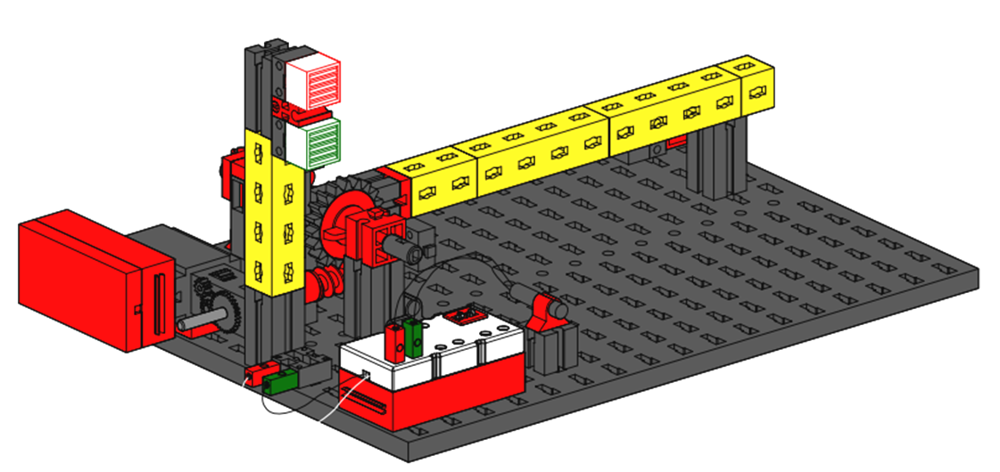
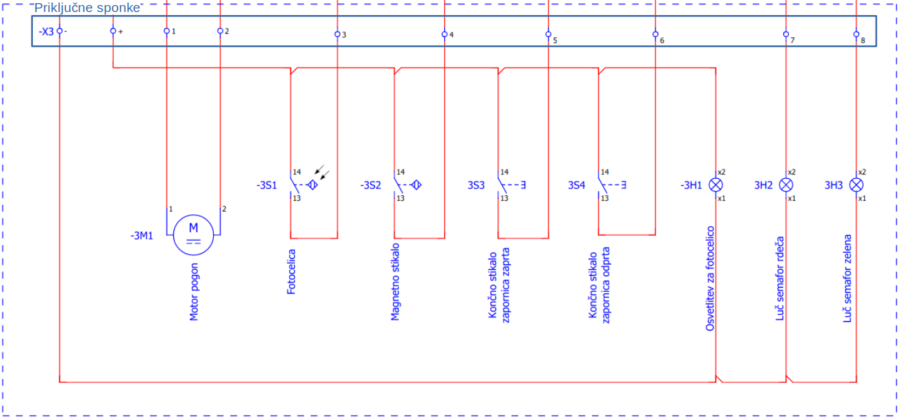
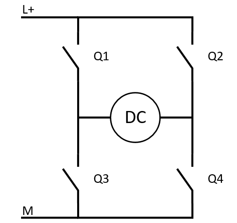
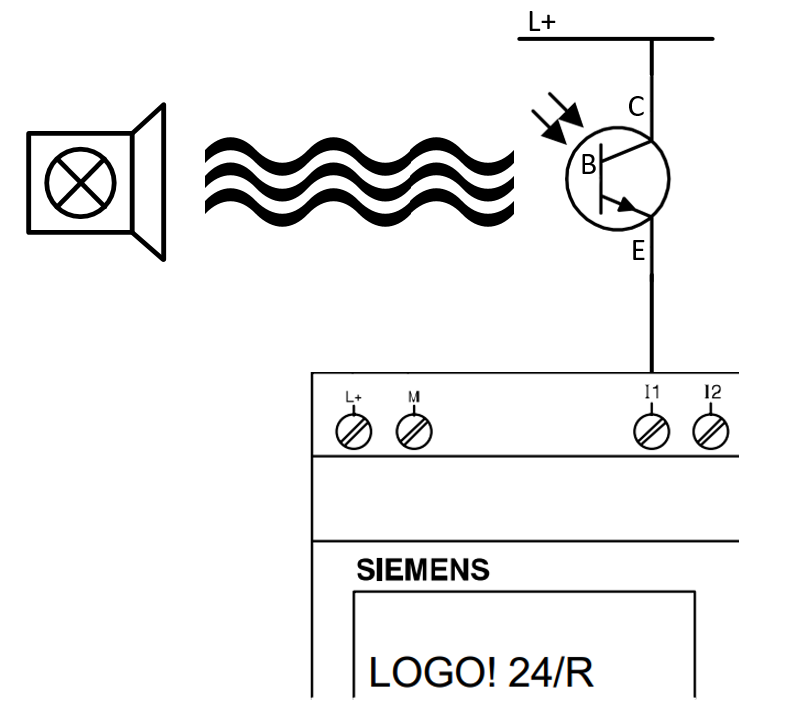

# Parkirna zapornica

Maketa zapornice je učni pripomoček, ki posnema obnašanje prave zapornice. Maketa omogoča izvedbo avtomatizacije s krmilnikom.

<figure><figcaption>
Izris makete parkirna zapornica
</figcaption></figure>

### Gradniki makete

Maketo sestavljajo naslednji gradniki:

* elektro motor s prenosom za pogon zapornica
* končne stikala za zaznavanje skrajnih položajev zapornice
* fotocelica, za zaznavanje vozila pod zapornico
* magnetno stikalo, za zaznavanje vozila pred zapornico
* semafor, z rdečo in zeleno lučjo, za signalizacijo vozniku
* priključne sponke

### Električna shema

Gradniki makete so električno povezani po shemi na sliki

<figure><figcaption></figcaption></figure>


Maketo napajamo z enosmerno napetostjo **12V**. Na priključno sponko **X3 +** priključimo pozitiven potencial na priključno sponko **X3 -** pa negativnega.


### Primeri priključitve gradnikov

Maketa ja zgrajena na način, ki dopušča svobodo pri izbiri načina vključitve njenih gradnikov v krmilni sistem. Podajamo pa po en primer pravilne priključitve za vsak gradnik makete.

#### Motor s prenosom

Pogon traku je izveden z uporabo enosmernega motorja in mehanskega prenosa za zmanjšanje obratov motorja. Smer vrtenja enosmernih motorjev je določna s smerjo toka, ki teče skoznje. Primer krmiljenja smeri motorja z uporabo štirih relejev povezanih v H mostič, je prikazan na sliki

<figure><figcaption>
Priključitev DC motorja v H mostič z uporabo 4 relejev
</figcaption></figure>

Če aktiviramo releja _Q1_ in _Q4_ potem steče tok od pozitivnega potenciala _L+_ skozi _Q1_ do levega priključka motorja. Nato nadaljuje pot iz desnega priključka motorja skozi _Q4_ in v negativni potencial _M_, kar požene motor. Vrtenje motorja obrnemo z aktivacijo _Q2_ in _Q3_, kjer podobno kot prej steče tok le, da je smer toka skozi motor iz desne proti levi, kar povzroči vrtenje motorja v drugo smer.

#### Fotocelica

Fotocelica je digitalno stikalo, ki spremeni stanje, ko pride med vir svetlobe in sprejemnik svetlobe ovira. Vir svetlobe fotocelice je žarnica, ki jo priklopimo na napajanje sprejemnik pa je foto občutljiv tranzistor. Fotocelica in primer priklopa na krmilnik sta prikazana na sliki

<figure><figcaption>
Priključitev fotocelice na digitalni vhod PLK
</figcaption></figure>

Ko pride ovira med žarnico in fototranzistor se prekine dotok svetlobe na bazo tranzistorja in tranzistor se zapre, kar pomeni, da tok iz pozitivnega potenciala vira _L+_ skozi tranzistor do digitalnega vhoda krmilnika ne teče več in to zaznamo kot logično 0.
