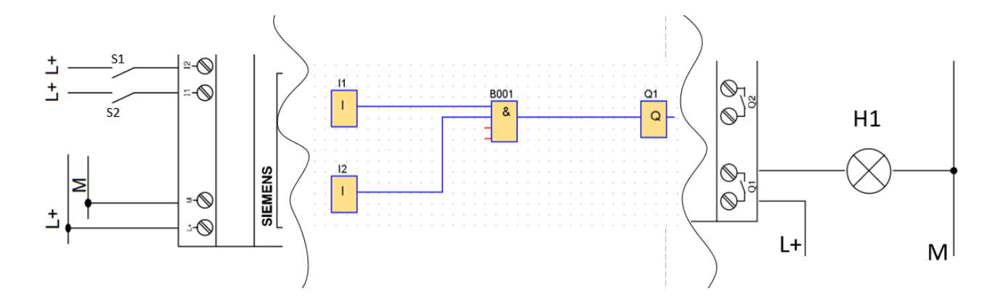

# Siemens LOGO

PLK LOGO podjetja Siemens, predstavlja vstopni segment krmilnikov za industrijsko rabo.

Gradiva:

* [Uporabniška navodila](https://files.gitbook.com/v0/b/gitbook-x-prod.appspot.com/o/spaces%2FOjZ1XG64rvc2AeRBUH5H%2Fuploads%2FMkk9RqfREhqdDBbizIOP%2Flogo\_manual.pdf?alt=media\&token=1bed8ffc-09b1-4e37-b233-91a7d7290fe4)
* [LogoSoftComfort V8.0 Demo](https://drive.google.com/file/d/1OZgJ\_CZv5HBBtY1p7byRcTMdeE-Z-HyA/view?usp=sharing)
* [LogoSoftComfort V6.0 (samo za izobraževalne namene)](https://drive.google.com/file/d/1OKeYmfERUlauEAGMq-3-49qWQ3DHIwju/view?usp=sharing)

## Opis krmilnika

Na sliki je prikazan PLK z označenimi sestavnimi deli. Jedro LOGO PLK sestavlja 32 bitni ARM mikrokrmilnik STR910FAW32. PLK ima 8 vhodov in 4 izhode, kar pomeni možnost priključitve osmih zunanjih digitalnih signalov in upravljanje štirih digitalnih signalov z uporabo 4 relejev.

<figure><figcaption>
Siemens Logo
</figcaption></figure>

Elementi PLK: 1 priklop za napajanje, 2 priključki vhodnih signalov, 3 priključki izhodnih signalov, 4 priključek za programiranje, 5 upravljalne tipke, 6 LCD prikazovalnik, 8 vmesnik za priklop razširitvenih modulov, 12 vmesnik za priklop zunanjega LCD prikazovalnika.

## Električna vezava

Krmilnik električno povežemo z napajanjem in z digitalnimi vhodi in digitalnimi izhodi.

### Napajanje PLK

PLK za svoje delovanje potrebuje napajanje, v našem primeru je to enosmerna napetost 24V. Priključitev napajanja na PLK je prikazana na spodnji sliki.

<figure><figcaption>
Priklop napajanja 
</figcaption></figure>

Oznaka na sliki L+ označuje pozitivni potencial in oznaka M negativni potencial napajalne napetosti.

### Digitalni vhodi

Vezava digitalnih vhodov na PLK nam omogoča spremljanje stanja digitalnih naprav, kot so končna stikala, tlačni stikala in vse druge vrste digitalnih naprav. Primer priklopa stikala prikazuje spodnja slika.

<figure><figcaption>
Priključitev stikal na digitalne vhode
</figcaption></figure>

### Digitalni izhodi

Vezava digitalnih izhodov na PLK nam omogoča izvajanje akcij oz. spreminjanje stanj digitalnih naprav, kot so luči, releji, motorji, črpalke in druge digitalne naprave. Nekatere verzije PLK imajo na izhodne signale že povezane vgrajene releje Q1, Q2, Q3 in Q4, kar pomeni, da imamo na voljo štiri programsko vodena stikala. Primer povezave bremena na digitalni izhod prikazuje spodnja slika.

<figure><figcaption>
Priključitev bremen na digitalne izhode
</figcaption></figure>

Digitalni izhod PLK je izveden z relejem, zato lahko breme krmilimo samo preko relejskega stikala. Na prvo sponko relejskega stikala priključimo pozitivni potencial vira (L+) na drugo sponko pa prvi konec bremena. Drugi konec bremena zvežemo na negativni potencial vira (M).

### Uporabniški vmesnik

Uporabniški vmesnik sestavljata alfanumerični LCD prikazovalnik in štiri tipke. Prikaze lahko razdelimo v dve skupini: Sistemski prikazi in uporabniški prikazi. Sistemski prikazi prikazujejo stanje programa, stanje digitalnih vhodov in izhodov omogočajo pa tudi enostavno urejanje programov. Slika prikazuje prikazovalnik v funkciji spremljanje stanja digitalnih vhodov in digitalnih izhodov.

<figure><figcaption>
Prikaz stanja digitalnega vhoda I1 in izhoda Q1
</figcaption></figure>

Ko se sklene stikalo S1 na prikazovalniku potemni številka 1 v prvi vrstici prikazovalnika, kar predstavlja logično 1 in obratno pri nesklenjenem stikalu S1 številka 1 ne potemni. Podobno tudi za digitalne izhode, ko v programu nastavimo izhod Q1 na logično 1 potemni oznaka 1 v zadnji vrstici prikazovalnika. Druga skupina prikazov pa je uporabniška, kar pomeni, da jih določijo uporabniki sami z uporabo programskega orodja. Možen je prikaz tekstov in števil tako celih kot decimalnih.

## Programsko orodje

Programsko orodje Logo Soft Comfort se uporablja za programiranje PLK Logo. Demo verzija programa omejuje programiranje v simulatorju oz. ne omogoča prenosa programa na krmilnik.

### Programiranje

Programsko orodje omogoča programiranje v dveh standardih jezikih funkcijskem diagramu (FBD) in lestvičnem diagramu (Ladder). Način izberemo pri izbiri novega projekta, kot je prikazano na spodnji sliki.

<figure><figcaption>
Ustvarjanje novega programa
</figcaption></figure>

Programiranje v FBD poteka grafično s postavitvijo in povezovanjem različnih funkcijskih blokov, ki so pripravljeni za uporabo v knjižnici orodja. Na sliki je prikazana postavitev funkcijskega bloka, ki predstavlja prvi digitalni vhod krmilnika, v program.

<figure><figcaption>
Postavitev funkcijskega bloka digitalnega vhoda v program
</figcaption></figure>

Podobno uporabljamo druge vrste blokov od logičnih funkcij AND, OR, ... do sekvenčnih blokov kot so RS flip-flopi pa časovnikov, števcev in še vrsto drugih blokov, ki nam jih ponuja orodje.

### Simulacija programa

Programsko orodje omogoča tudi simulacijo programa. S simulacijo programa lahko preverimo njegovo delovanje brez da bi vplivali na digitalne izhode sistema, kar pomeni da lahko testiramo program v izoliranem virtualnem okolju. Vključitev simulatorja prikazuje spodnja slika

<figure><figcaption>
Z levim klikom miške lahko iz menija izberemo simulacijo
</figcaption></figure>

Simulator upravljamo preko ukaznega menija, ki se nam izriše pod shemo. Ko simulator poženemo lahko virtualno upravljamo digitalne vhode ter opazujemo reakcije uporabljenih blokov. Če so bloki in povezave modre barve predstavlja logično 1 če pa rdeče pa logično 0. Torej če je blok Q obrobljen z rdečo črto digitalni izhod ni aktiviran in obratno če ima rob modre barve je aktiviran. Spodnja slika prikazuje povezavo bloka digitalnega vhoda z blokom digitalnega izhoda. Ker je digitalni vhod aktiviran se ta informacija prenese do izhodnega bloka preko povezave in celotna pot se obarva modro.

<figure><figcaption>
Prikaz stanj v načinu simulacije programa
</figcaption></figure>

### Nastavitev komunikacijskega vmesnika

Pred prvim programiranjem krmilnika je potrebno krmilnik in osebni računalnik povezati z programerskim vmesnikom. Če uporabljamo operacijski sistem Windows nam sistem ob priklopu vmesnika le njega avtomatsko zazna in namesti vse potrebne gonilnike za njegovo delovanje. Ta vmesnik moramo nato pravilno nastaviti tudi v programskem okolju Soft Comfort, kot prikazuje spodnja slika (Tools $$\rightarrow$$ Options)

<figure><figcaption>
Nastavitev serijskega vmesnika
</figcaption></figure>

### Prenos programa na krmilnik

Prenos programa na krmilnik poteka preko ukaznega menija kot je prikazano na sliki

<figure><figcaption>
Prenos programa na PLK
</figcaption></figure>

Po prenosu programa na krmilnik je potreben še njegov zagon, saj se krmilnik zaradi varnosti nikoli sam ne prične izvajati pravkar naloženega programa. To je mogoče izvesti na dva načina preko zaslona krmilnika ali pa preko programskega orodja.

### Monitoring programa

Programsko orodje tudi omogoča spremljanje delovanje programa v realnem času, kar nudi gobji vpogled v njegovo delovanje in omogoča lažje razhroščevanje oz. odpravljanje napak. Funkcija monitoringa je dosegljiva z desnim klikom na skico kot prikazuje spodnja slika

<figure><figcaption>
Online Test omogoča vpogled v stanje spremenljivk in blokov trenutnega programa v izvajanju
</figcaption></figure>

Monitoring prikazuje stanje programa podobno kot simulator le, da pri monitoringu ni mogoče programsko spreminjati stanja digitalnih vhodov saj so ta odvisna od stanja povezanih naprav na PLK.

## Delovanja krmilnika na primeru

Spodnja slika shematsko prikazuje povezavo med PLK ter digitalnimi izhodi in vhodi.

<figure><figcaption>
Prikaz prehajanja informacije od izvora (stikala) preko PLK do ponora (Luč)
</figcaption></figure>

Primer prikazuje električno vezavo dveh stikal S1 in S2 na digitalne vhode I1 in I2, električno vezavo digitalnega izhoda Q1 na luč H1, ter program, ki ju logično povezuje. Stikali S1 in S2 dobita svoji virtualni sliki v programu FDB kot vhodna bloka (I) in sta označena z I1 in I2. Ko sta stikali pritisnjena se njuna stanja preneseta v program kot logična 1 na izhodu blokov I1 in I2. Vhodna bloka sta nato povezana na blok logične funkcije in (&), ki svoj izhod postavi na logično ena samo kadar so vsi njeni vhodi enaki logični 1 (ko pritisnemo oba stikala). Ko je izhod logične in funkcije enak 1 se postavi tudi izhodni blok Q1 na logično 1, kar pomeni, da se rele sklene in, preko električne povezave na izhodu, prižge luč H1.
