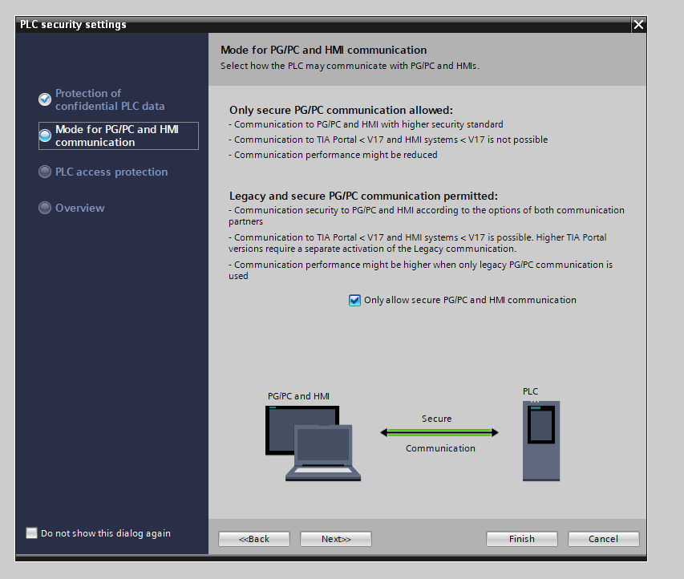
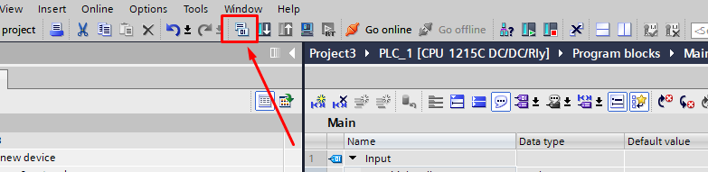

# Simatic 1200

## Električna vezava PLK

### Povezava napajanja

### Povezava digitalnega vhoda

### Povezava digitalnega izhoda

### Povezava DC motorja v H mostič

## Programiranje

### Prvi zagon

1. Na namizju vašega PC najdite program TIA Portal V18 in ga zaženite

<figure><figcaption>
Zagon programa TIA portal
</figcaption></figure>

2. Ko se program naloži se vam pokaže naslednje okno. Izberete _Create new project_

<figure><figcaption>
Zagonski zaslon programa TIA portal
</figcaption></figure>

3. Poimenujemo nov projekt in potrdimo

<figure><figcaption>
Kreiranje novega projekta
</figcaption></figure>

4. Ko je projekt ustvarjen se nam pokaže naslednj okno. Izberemo _Configure a device_

<figure><figcaption>
Prikaz možnosti nadaljnjega razvoja projekta
</figcaption></figure>

5. Dodamo novo napravo z izbiro prikazano na sliki

<figure><figcaption>
Prikaz naprav in možnosti za dodajanje nove naprave
</figcaption></figure>

6. Pojavi se nam izbirnik preko katerega izberemo ustrezno napravo. Izbrati je potrebno tako ustrezen CPU (Centralno procesno enoto) kot konfiguracijo vhodnih in izhodnih enot. Oznako najdemo napisano na boku PLK.

<figure><figcaption>
Izbira ustrezne konfiguracije PLK
</figcaption></figure>

7. V naslednjem koraku je potrebno izbrati ustrezen firmware (programsko kodo PLK), ki jo uporablja izbrani PLK. V našem primeru je to _V4.5._

<figure><figcaption>
Izbira firmware PLK
</figcaption></figure>

<figure><figcaption></figcaption></figure>

<figure><figcaption></figcaption></figure>

<figure><figcaption></figcaption></figure>

<figure><figcaption></figcaption></figure>

<figure><figcaption></figcaption></figure>

<figure><figcaption></figcaption></figure>

<figure><figcaption></figcaption></figure>

<figure><figcaption></figcaption></figure>

<figure><figcaption>
imag
</figcaption></figure>

<figure><figcaption></figcaption></figure>

<figure><figcaption></figcaption></figure>

<figure><figcaption></figcaption></figure>

<figure><figcaption></figcaption></figure>

<figure><figcaption></figcaption></figure>

<figure><figcaption></figcaption></figure>

<figure><figcaption></figcaption></figure>

<figure><figcaption></figcaption></figure>

<figure><figcaption></figcaption></figure>

<figure><figcaption></figcaption></figure>

<figure><figcaption></figcaption></figure>
