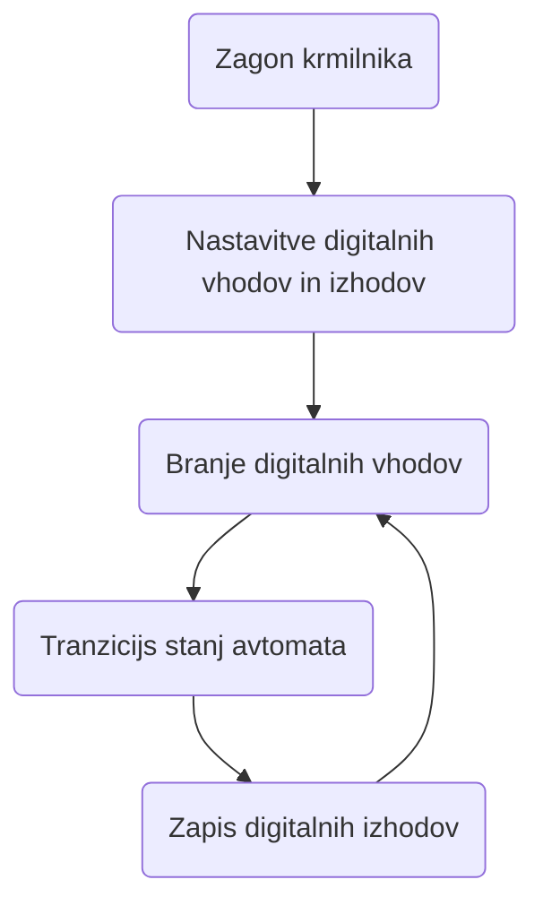
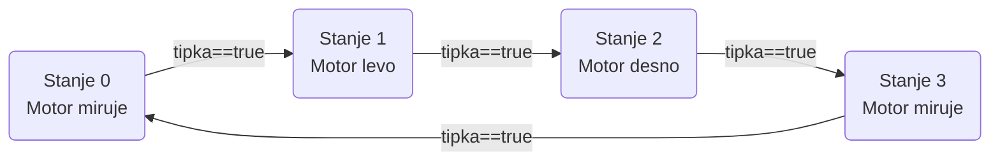
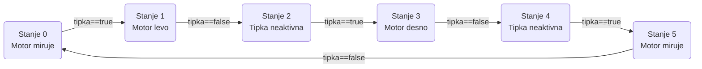

# Implementacija Moorovega avtomata

## Implementacija Moorovega avtomata

Izdelali bomo sistem za krmiljenje enosmernega motorja, ki mora delovati na sledeči način:

1. Ko prvič pritisnemo tipko se motor požene v levo
2. Ko drugič pritisnemo tipko se motor ustavi
3. Ko tretjič pritisnemo tipko se motor požene v desno
4. Ob četrtem pritisku tipke se motor ustavi
5. Zgornja sekvenca se ponavlja neskončno dolgo

Izdelati moramo električno vezje in programsko kodo.

### Električno vezje

Električno vezje mora imeti tipko in biti sposobno krmiliti električni motor. Vključitev tipke v električno vezje si lahko ogledate v [gradivu](<../README (1).md>). Električno vezje za krmiljenje enosmernega motorja v vse smeri pa je predstavljeno v [gradivu](../elektrotehnika/enosmerni-motor-in-mikrokrmilnik.md).

### Programska koda

Krmilni sistem za naš problem lahko zapišemo v obliki Moorovega končnega avtomata. Izhodi moorovega avtomata so odvisni samo od trenutnega stanja avtomata. Vhodi vplivajo samo na spremembo stanja avtomata, torej na izhode vplivajo posredno. Splošen diagram poteka implementacija moorovega avtomata za krmilni sistem.



Avtomat deluje po korakih:

1. Krmilnik se zažene ko priključimo napajanje
2. Nastavitve krmilnika
3. Preberemo vrednosti digitalnih vhodov in njihove vrednosti shranimo
4. Izvedemo en korak oz. tranzicijo avtomata
5. Zapišemo nove vrednosti digitalnih izhodov
6. Vrnemo se v korak branja digitalnih vhodov

Avtomat deluje v zanki neskončno dolgo oz. dokler ne izključimo napajanja krmilnika.

#### Zapis avtomata krmilnega sistema

Iz opisa naloge načrtamo diagram prehajanja stanj, ki določa tranzicije moorovega avtomata.



!> Pozor! Ker implementacija avtomata deluje v zanki moramo biti previdni pri prehajanju stanj, kjer so pogoji za prehod vrednosti digitalnih vhodov. Več o tem v gradivu.

Popravljen diagram prehajanja stanj, zaradi vpliva digitalnega vhoda.



#### Prevedba v programsko kodo

Pri pisanju kode si bomo pomagali s funkcijami iz knjižnice Arduino projekta.

* [pinMode()](https://www.arduino.cc/reference/en/language/functions/digital-io/pinmode/)
* [digitalRead()](https://www.arduino.cc/reference/en/language/functions/digital-io/digitalread/)
* [digitalWrite()](https://www.arduino.cc/reference/en/language/functions/digital-io/digitalwrite/)

Celoten moorov avtomat, ki ga sestavlja: Branje digitalnih vhodov, tranzicije stanj in zapisovanje digitalnih izhodov prevedemo v C kodo za Arduino. Zapisovanje digitalnih izhodov smo izvedli z uporabo funkcije $motorGonilnik()$

```c
//Globalne konstante
//Pini digitalnih vhodov
int S0pin = 0; //tipka
//Pini digitalnih izhodov
int Q1pin = 1;  //rele 1
int Q2pin = 2;  //rele 2
int Q3pin = 3;  //rele 3
int Q4pin = 4;  //rele 4

//Globalne spremenljivke
bool S0 = false;  //Spremenljivka tipke
int state = 0;  //Spremenljivka stanja avtomata
int motor = 0;  //Spremenljivka stanja motorja 0/1/2...stop/levo/desno

//Nastavitvena funkcija
void setup() {
  pinMode(S0pin, INPUT);  //Nastavimo pin 0 kot digitalni vhod
  //Nastavimo pine 1, 2, 3, 4 kot digitalne izhode za krmiljenje motorja s H mostičem
  pinMode(Q1pin, OUTPUT);
  pinMode(Q2pin, OUTPUT);
  pinMode(Q3pin, OUTPUT);
  pinMode(Q4pin, OUTPUT);
}

//Krožna funkcija
void loop() {
  //Preberemo vrednosti digitalnih vhodov
  S0 = digitalRead(S0pin);
  //Tranzicija avtomata
  switch (state) {
    //Stanje 0: motor miruje
    case 0: {
        if (S0 == true) { //Ali je tipka aktivna
          state++;  //Spremenimo stanje
          motor = 1;  //Določimo vrtenje motorja levo
        }
      } break;
    // Stanje 1: motor se vrti levo
    case 1: {
        if (S0 == false) {  //Ali je tipka neaktivna
          state++;  //Spremenimo stanje
        }
      } break;
    // Stanje 2: tipka je neaktivna
    case 2: {
        if (S0 == true) { //Ali je tipka aktivna
          state++;  //Spremenimo stanje
          motor = 2;  //Določimo vrtenje motorja desno
        }
      } break;
    // Stanje 3: motor se vrti desno
    case 3: {
        if (S0 == false) {  //Ali je tipka neaktivna
          state++;  //Spremenimo stanje
        }
      } break;
    // Stanje 4: tipka je neaktivna
    case 4: {
        if (S0 == true) { //Ali je tipka aktivna
          state++;  //Spremenimo stanje
          motor = 0;  //Določimo vrtenje motorja stop
        }
      } break;
    // stanje 5: motor stoji
    case 5: {
        if (S0 == false) {  //Ali je tipka neaktivna
          state = 0;  //Spremenimo stanje
        }
      } break;
  }
  //Zapišemo vrednosti digitalnih izhodov
  motorGonilnik(motor);
}

//Funkcija za krmiljenje motorja
void motorGonilnik(int smer) {
  //Motor stop
  if (smer == 0) {
    digitalWrite(Q1pin, LOW);
    digitalWrite(Q2pin, LOW);
    digitalWrite(Q3pin, LOW);
    digitalWrite(Q4pin, LOW);
  }
  //Motor levo
  if (smer == 1) {
    digitalWrite(Q1pin, HIGH);
    digitalWrite(Q2pin, HIGH);
    digitalWrite(Q3pin, LOW);
    digitalWrite(Q4pin, LOW);
  }
  //Motor desno
  if (smer == 2) {
    digitalWrite(Q1pin, LOW);
    digitalWrite(Q2pin, LOW);
    digitalWrite(Q3pin, HIGH);
    digitalWrite(Q4pin, HIGH);
  }
}
```
